# 跨平台轻量级渲染引擎对象抽象设计

## 1. 概述

### 1.1 设计目标

设计并实现一套轻量级的跨平台渲染引擎，通过抽象不同图形API（Opengl、OpenGL ES、Vulkan、Metal）的核心概念，提供统一的渲染接口。该引擎需要：

- 支持多平台图形API（OpenGL、OpenGL ES3.0/3.1/3.2、Vulkan、Metal）
- 提供清晰的对象抽象层，隐藏不同API的实现细节
- 采用现代C++设计模式，遵循Google编码规范
- 保持轻量级，避免过度设计
- 在macOS平台上基于GLFW实现可执行Demo

### 1.2 技术栈

| 组件 | 技术选型 | 说明 |
|------|---------|------|
| 编程语言 | C++17 | 使用现代C++特性，如智能指针、移动语义等 |
| 图形API | OpenGL、OpenGL ES3.0/3.1/3.2, Metal, Vulkan | 主要支持的图形API |
| 窗口系统 | GLFW 3.x | 跨平台窗口和输入处理 |
| 编码规范 | Google C++ Style Guide | 统一代码风格 |
| 多线程库 | dispatch_queue | 基于任务队列的多线程抽象 |
| 数学库 | hyengine::math | 模板化的向量和矩阵运算 |

### 1.3 架构原则

- **分层设计**：核心抽象层、平台实现层、业务应用层相互独立
- **工厂模式**：通过RenderContext工厂创建各类渲染资源对象
- **策略模式**：PipelineState封装不同的渲染状态配置策略
- **资源管理**：基于智能指针的自动资源生命周期管理
- **接口隔离**：最小化接口依赖，各对象职责单一明确
- **异步加载**：基于TaskQueue的异步资源加载机制
- **线程安全**：渲染命令在专用渲染线程执行，资源加载可异步并行

### 1.4 项目目录结构

```
hy_render/                          # 新建渲染引擎项目根目录
├── CMakeLists.txt                  # 主CMake配置
├── include/                        # 公共头文件
│   └── hy_render/
│       ├── HYRenderEngine.hpp
│       ├── HYRenderContext.hpp
│       └── resources/
│           ├── HYBuffer.hpp
│           ├── HYTexture.hpp
│           ├── HYShader.hpp
│           └── ...
├── src/                            # 源代码实现
│   ├── core/                       # 核心抽象层
│   │   ├── HYRenderEngine.cpp
│   │   ├── HYRenderContext.cpp
│   │   └── resources/
│   │       ├── HYBuffer.cpp
│   │       ├── HYTexture.cpp
│   │       ├── HYShader.cpp
│   │       ├── HYFrameBuffer.cpp
│   │       ├── HYPipelineState.cpp
│   │       ├── HYRenderPass.cpp
│   │       ├── HYSampler.cpp
│   │       ├── HYVertexArray.cpp
│   │       └── HYFence.cpp
│   ├── opengl/                     # OpenGL 3.3+ Core Profile实现
│   │   ├── RenderContextGL.cpp
│   │   └── resources/
│   │       ├── BufferGL.cpp
│   │       ├── TextureGL.cpp
│   │       ├── ShaderGL.cpp
│   │       ├── FrameBufferGL.cpp
│   │       ├── PipelineStateGL.cpp
│   │       ├── RenderPassGL.cpp
│   │       ├── SamplerGL.cpp
│   │       ├── VertexArrayGL.cpp
│   │       └── FenceGL.cpp
│   ├── opengles/                   # OpenGL ES 3.0/3.1实现
│   │   ├── RenderContextGLES.cpp
│   │   └── resources/
│   │       ├── BufferGLES.cpp
│   │       ├── TextureGLES.cpp
│   │       ├── ShaderGLES.cpp
│   │       ├── FrameBufferGLES.cpp
│   │       ├── PipelineStateGLES.cpp
│   │       ├── RenderPassGLES.cpp
│   │       ├── SamplerGLES.cpp
│   │       ├── VertexArrayGLES.cpp
│   │       └── FenceGLES.cpp
│   ├── metal/                      # Metal实现
│   │   ├── RenderContextMtl.mm
│   │   └── resources/
│   │       ├── BufferMtl.mm
│   │       ├── TextureMtl.mm
│   │       ├── ShaderMtl.mm
│   │       ├── FrameBufferMtl.mm
│   │       ├── PipelineStateMtl.mm
│   │       ├── RenderPassMtl.mm
│   │       ├── SamplerMtl.mm
│   │       └── FenceMtl.mm
│   ├── vulkan/                     # Vulkan实现
│   │   ├── RenderContextVk.cpp
│   │   └── resources/
│   │       ├── BufferVk.cpp
│   │       ├── TextureVk.cpp
│   │       ├── ShaderVk.cpp
│   │       ├── FrameBufferVk.cpp
│   │       ├── PipelineStateVk.cpp
│   │       ├── RenderPassVk.cpp
│   │       ├── SamplerVk.cpp
│   │       └── FenceVk.cpp
│   ├── gl_common/                  # OpenGL/OpenGL ES共享代码
│   │   ├── RenderContextGLBase.cpp
│   │   ├── GLUtils.cpp             # GL工具函数
│   │   └── GLExtensions.cpp        # 扩展检测
│   ├── math/                       # 数学库（优化版）
│   │   ├── Vector.hpp              # 统一的向量模板
│   │   ├── Matrix.hpp              # 统一的矩阵模板
│   │   ├── Quaternion.hpp
│   │   ├── Transform.hpp           # 变换组合
│   │   └── MathUtils.hpp
│   └── utils/                      # 工具类
│       ├── ResourceLoader.hpp      # 异步资源加载器
│       ├── ShaderCompiler.hpp      # 着色器编译工具
│       └── Logger.hpp              # 日志工具
├── demo/                           # Demo示例
│   ├── CMakeLists.txt
│   ├── main.cpp
│   ├── shaders/
│   │   ├── basic.vert
│   │   └── basic.frag
│   └── assets/
│       └── textures/
└── tests/                          # 单元测试
    ├── test_buffer.cpp
    ├── test_texture.cpp
    └── ...
```

## 2. 图形API渲染流程分析

### 2.1 支持的图形API概览

**目标平台与API映射**：

| 平台 | 图形API | 版本 | 说明 |
|------|--------|------|------|
| Windows/Linux/macOS | OpenGL | 3.3+ Core Profile | 桌面端跨平台方案 |
| Android/iOS | OpenGL ES | 3.0/3.1 | 移动端标准方案 |
| iOS/macOS | Metal | 2.0+ | Apple原生高性能方案 |
| Windows/Linux/Android | Vulkan | 1.0+ | 次世代跨平台方案 |

**API特性对比**：

| 特性 | OpenGL 3.3+ | OpenGL ES 3.0 | Metal | Vulkan |
|------|-------------|---------------|-------|--------|
| **抽象层次** | 中高层 | 高层 | 中层 | 低层 |
| **状态管理** | 全局状态机 | 全局状态机 | 显式Pipeline | 显式Pipeline |
| **多线程** | 受限支持 | 受限支持 | 原生支持 | 原生支持 |
| **命令提交** | 立即模式 | 立即模式 | 延迟提交 | 批量提交 |
| **内存管理** | 驱动自动 | 驱动自动 | 半自动 | 完全手动 |
| **着色器语言** | GLSL 3.3+ | GLSL ES 3.0 | MSL | SPIR-V |
| **计算着色器** | ✓ | ✓ (ES 3.1) | ✓ | ✓ |
| **几何着色器** | ✓ | ✗ | ✗ | ✓ |
| **曲面细分** | ✓ | ✗ | ✓ | ✓ |
| **多重采样** | ✓ | ✓ | ✓ | ✓ |
| **纹理压缩** | 多种格式 | ETC2/ASTC | PVRTC/ASTC | 多种格式 |

### 2.2 OpenGL桌面版渲染流程

**OpenGL Core Profile渲染洁程**：

核心对象增强：
- Context：OpenGL上下文（Core Profile 3.3+）
- **VAO：顶点数组对象（Vertex Array Object，必须使用）**
- VBO/EBO：顶点缓冲/元素缓冲对象
- UBO/SSBO：统一缓冲对象/着色器存储缓冲对象
- Shader/Program：着色器程序
- **Texture/Sampler：纹理和采样器（支持分离式采样器）**
- Framebuffer/Renderbuffer：帧缓冲和渲染缓冲
- Sync：同步对象

**OpenGL与OpenGL ES关键差异**：

| 特性 | OpenGL 3.3+ | OpenGL ES 3.0 | 差异说明 |
|------|-------------|---------------|----------|
| **VAO使用** | 必须使用 | 可选 | Core Profile强制要求VAO |
| **精度限定符** | 可选 | 必须 | ES必须显式声明 |
| **分离采样器** | 原生支持 | 不支持 | GL可单独创建Sampler对象 |
| **深度范围** | glDepthRange | glDepthRangef | 参数类型差异 |
| **多重纹理** | GL_TEXTURE0+n | GL_TEXTURE0+n | 一致 |

### 2.3 OpenGL ES 3.0渲染流程

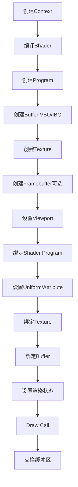
```mermaid
graph TD
    A[创建Context] --> B[编译Shader]
    B --> C[创建Program]
    C --> D[创建Buffer VBO/IBO]
    D --> E[创建Texture]
    E --> F[创建Framebuffer可选]
    F --> G[设置Viewport]
    G --> H[绑定Shader Program]
    H --> I[设置Uniform/Attribute]
    I --> J[绑定Texture]
    J --> K[绑定Buffer]
    K --> L[设置渲染状态]
    L --> M[Draw Call]
    M --> N[交换缓冲区]
```

**核心对象**：
- Context：OpenGL上下文
- Shader/Program：着色器程序
- Buffer：顶点缓冲（VBO）、索引缓冲（IBO）、统一缓冲（UBO）
- Texture：纹理对象
- Framebuffer：帧缓冲对象（FBO）
- Renderbuffer：渲染缓冲对象（RBO）
- Sampler：纹理采样器

### 2.3 OpenGL ES 3.0渲染流程

**核心对象**：
- Context：OpenGL ES上下文
- Shader/Program：着色器程序
- Buffer：顶点缓冲（VBO）、索引缓冲（IBO）、统一缓冲（UBO）
- Texture：纹理对象（采样器状态内嵌）
- Framebuffer：帧缓冲对象（FBO）
- Renderbuffer：渲染缓冲对象（RBO）

### 2.4 Metal渲染流程

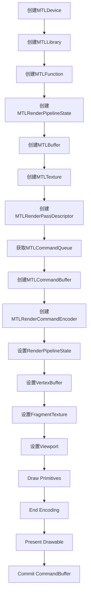
```mermaid
graph TD
    A[创建MTLDevice] --> B[创建MTLLibrary]
    B --> C[创建MTLFunction]
    C --> D[创建MTLRenderPipelineState]
    D --> E[创建MTLBuffer]
    E --> F[创建MTLTexture]
    F --> G[创建MTLRenderPassDescriptor]
    G --> H[获取MTLCommandQueue]
    H --> I[创建MTLCommandBuffer]
    I --> J[创建MTLRenderCommandEncoder]
    J --> K[设置RenderPipelineState]
    K --> L[设置VertexBuffer]
    L --> M[设置FragmentTexture]
    M --> N[设置Viewport]
    N --> O[Draw Primitives]
    O --> P[End Encoding]
    P --> Q[Present Drawable]
    Q --> R[Commit CommandBuffer]
```

**核心对象**：
- Device：图形设备抽象
- Library：Shader库
- Function：着色器函数
- RenderPipelineState：渲染管线状态
- Buffer：各类缓冲区
- Texture：纹理对象
- Sampler：采样器状态
- RenderPassDescriptor：渲染通道描述
- CommandQueue：命令队列
- CommandBuffer：命令缓冲
- RenderCommandEncoder：渲染命令编码器

### 2.5 Vulkan渲染流程

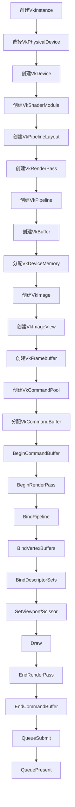
```mermaid
graph TD
    A[创建VkInstance] --> B[选择VkPhysicalDevice]
    B --> C[创建VkDevice]
    C --> D[创建VkShaderModule]
    D --> E[创建VkPipelineLayout]
    E --> F[创建VkRenderPass]
    F --> G[创建VkPipeline]
    G --> H[创建VkBuffer]
    H --> I[分配VkDeviceMemory]
    I --> J[创建VkImage]
    J --> K[创建VkImageView]
    K --> L[创建VkFramebuffer]
    L --> M[创建VkCommandPool]
    M --> N[分配VkCommandBuffer]
    N --> O[BeginCommandBuffer]
    O --> P[BeginRenderPass]
    P --> Q[BindPipeline]
    Q --> R[BindVertexBuffers]
    R --> S[BindDescriptorSets]
    S --> T[SetViewport/Scissor]
    T --> U[Draw]
    U --> V[EndRenderPass]
    V --> W[EndCommandBuffer]
    W --> X[QueueSubmit]
    X --> Y[QueuePresent]
```

**核心对象**：
- Instance：Vulkan实例
- PhysicalDevice：物理设备
- Device：逻辑设备
- Queue：队列
- CommandPool：命令池
- CommandBuffer：命令缓冲
- ShaderModule：着色器模块
- Pipeline：图形管线
- PipelineLayout：管线布局
- RenderPass：渲染通道
- Framebuffer：帧缓冲
- Buffer：缓冲区
- DeviceMemory：设备内存
- Image：图像
- ImageView：图像视图
- Sampler：采样器
- DescriptorSet：描述符集
- DescriptorPool：描述符池

### 2.6 四大API对比分析

| 特性维度 | OpenGL 3.3+ | OpenGL ES 3.0 | Metal | Vulkan |
|---------|-------------|---------------|-------|--------|
| **抽象层次** | 中高层API | 高层API | 中层API | 低层API |
| **状态管理** | 全局状态机 | 全局状态机 | 显式Pipeline | 显式Pipeline |
| **VAO要求** | 必须 | 可选 | N/A | N/A |
| **采样器** | 分离式 | 内嵌式 | 独立对象 | 独立对象 |
| **多线程** | 受限支持 | 受限支持 | 原生支持 | 原生支持 |
| **资源绑定** | 基于槽位 | 基于槽位 | ArgumentBuffer | DescriptorSet |
| **命令提交** | 立即模式 | 立即模式 | 延迟提交 | 批量提交 |
| **内存管理** | 驱动自动 | 驱动自动 | 半自动 | 完全手动 |
| **同步机制** | Fence/Sync | Fence/Sync | Fence/Event | 多种同步原语 |
| **着色器** | GLSL | GLSL ES | MSL | SPIR-V |
| **学习曲线** | 中等 | 简单 | 中等 | 陡峭 |

## 3. 核心抽象对象设计

### 3.1 对象分类与职责

根据对OpenGL ES、Metal、Vulkan三大API的分析，抽象出以下核心对象：

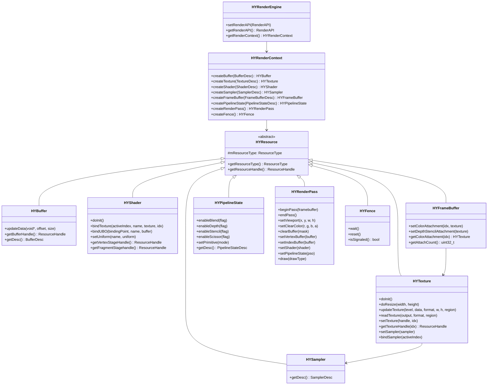
```mermaid
classDiagram
    class HYRenderEngine {
        +setRenderAPI(RenderAPI)
        +getRenderAPI() RenderAPI
        +getRenderContext() HYRenderContext
    }
    
    class HYRenderContext {
        +createBuffer(BufferDesc) HYBuffer
        +createTexture(TextureDesc) HYTexture
        +createShader(ShaderDesc) HYShader
        +createSampler(SamplerDesc) HYSampler
        +createFrameBuffer(FrameBufferDesc) HYFrameBuffer
        +createPipelineState(PipelineStateDesc) HYPipelineState
        +createRenderPass() HYRenderPass
        +createFence() HYFence
    }
    
    class HYResource {
        <<abstract>>
        #mResourceType: ResourceType
        +getResourceType() ResourceType
        +getResourceHandle() ResourceHandle
    }
    
    class HYBuffer {
        +updateData(void*, offset, size)
        +getBufferHandle() ResourceHandle
        +getDesc() BufferDesc
    }
    
    class HYTexture {
        +doInit()
        +doResize(width, height)
        +updateTexture(level, data, format, w, h, region)
        +readTexture(output, format, region)
        +setTexture(handle, idx)
        +getTextureHandle(idx) ResourceHandle
        +setSampler(sampler)
        +bindSampler(activeIndex)
    }
    
    class HYShader {
        +doInit()
        +bindTexture(activeIndex, name, texture, idx)
        +bindUBO(bindingPoint, name, buffer)
        +setUniform(name, uniform)
        +getVertexStageHandle() ResourceHandle
        +getFragmentStagehandle() ResourceHandle
    }
    
    class HYFrameBuffer {
        +setColorAttachment(idx, texture)
        +setDepthStencilAttachment(texture)
        +getColorAttachment(idx) HYTexture
        +getAttachCount() uint32_t
    }
    
    class HYPipelineState {
        +enableBlend(flag)
        +enableDepth(flag)
        +enableStencil(flag)
        +enableScissor(flag)
        +setPrimitive(mode)
        +getDesc() PipelineStateDesc
    }
    
    class HYRenderPass {
        +beginPass(framebuffer)
        +endPass()
        +setViewport(x, y, w, h)
        +setClearColor(r, g, b, a)
        +clearBuffer(mask)
        +setVertexBuffer(buffer)
        +setIndexBuffer(buffer)
        +setShader(shader)
        +setPipelineState(pso)
        +draw(drawType)
    }
    
    class HYSampler {
        +getDesc() SamplerDesc
    }
    
    class HYFence {
        +wait()
        +reset()
        +isSignaled() bool
    }
    
    HYRenderEngine --> HYRenderContext
    HYRenderContext --> HYResource
    HYResource <|-- HYBuffer
    HYResource <|-- HYTexture
    HYResource <|-- HYShader
    HYResource <|-- HYFrameBuffer
    HYResource <|-- HYPipelineState
    HYResource <|-- HYRenderPass
    HYResource <|-- HYSampler
    HYResource <|-- HYFence
    
    HYTexture --> HYSampler
    HYFrameBuffer --> HYTexture
```

### 3.2 HYRenderEngine - 渲染引擎单例

**设计意图**：
作为全局渲染引擎入口，管理渲染API类型和RenderContext的创建。

**职责**：
- 设置和查询当前使用的渲染API（OpenGL ES/Metal/Vulkan）
- 提供全局唯一的RenderContext实例
- 采用单例模式确保全局只有一个渲染引擎实例

**关键接口**：

| 接口方法 | 参数 | 返回值 | 说明 |
|---------|------|--------|------|
| setRenderAPI | RenderAPI api | void | 设置渲染API类型 |
| getRenderAPI | 无 | RenderAPI | 获取当前渲染API |
| getRenderContext | 无 | shared_ptr\<HYRenderContext\> | 获取渲染上下文 |

### 3.3 HYRenderContext - 渲染上下文

**设计意图**：
作为资源工厂，负责创建所有渲染相关的资源对象。不同平台实现各自的子类（RenderContextGL、RenderContextMtl、RenderContextVk）。

**职责**：
- 创建各种渲染资源（Buffer、Texture、Shader等）
- 封装平台特定的上下文初始化逻辑
- 作为抽象工厂，隐藏平台差异

**平台实现**：
- **RenderContextGL**：OpenGL ES实现
- **RenderContextMtl**：Metal实现
- **RenderContextVk**：Vulkan实现（待扩展）

**关键接口**：

| 接口方法 | 参数 | 返回值 | 说明 |
|---------|------|--------|------|
| createBuffer | BufferDesc | shared_ptr\<HYBuffer\> | 创建缓冲区对象 |
| createTexture | TextureDesc | shared_ptr\<HYTexture\> | 创建纹理对象 |
| createShader | ShaderDesc | shared_ptr\<HYShader\> | 创建着色器对象 |
| createSampler | SamplerDesc | shared_ptr\<HYSampler\> | 创建采样器对象 |
| createFrameBuffer | FrameBufferDesc | shared_ptr\<HYFrameBuffer\> | 创建帧缓冲对象 |
| createPipelineState | PipelineStateDesc | shared_ptr\<HYPipelineState\> | 创建管线状态对象 |
| createRenderPass | 无 | shared_ptr\<HYRenderPass\> | 创建渲染通道对象 |
| createFence | 无 | shared_ptr\<HYFence\> | 创建同步栅栏对象 |

### 3.4 HYResource - 资源基类

**设计意图**：
所有渲染资源的抽象基类，提供统一的资源类型识别和句柄访问接口。

**职责**：
- 定义资源类型枚举（Buffer、Texture、Shader等）
- 提供获取平台原生句柄的虚接口
- 作为所有渲染资源的多态基类

**资源类型枚举**：

| 资源类型 | 说明 |
|---------|------|
| BUFFER | 缓冲区资源 |
| TEXTURE | 纹理资源 |
| SHADER | 着色器资源 |
| FRAMEBUFFER | 帧缓冲资源 |
| PIPELINE_STATE | 管线状态资源 |
| RENDER_PASS | 渲染通道资源 |
| SAMPLER | 采样器资源 |
| FENCE | 同步栅栏资源 |

### 3.5 HYBuffer - 缓冲区对象

**设计意图**：
抽象顶点缓冲（VBO）、索引缓冲（IBO）、统一缓冲（UBO）等各类GPU缓冲区。

**职责**：
- 管理GPU侧的缓冲区内存
- 提供数据上传接口
- 描述缓冲区的用途（顶点/索引/Uniform）和访问模式（静态/动态/流式）

**缓冲区描述 BufferDesc**：

| 字段 | 类型 | 说明 |
|------|------|------|
| bindFlags | BufferBindFlag | 绑定类型（顶点/索引/Uniform） |
| usage | BufferUsage | 使用模式（静态/动态/流式） |
| layoutElements | vector\<LayoutElement\> | 数据布局描述 |

**缓冲区绑定类型**：

| 类型 | OpenGL ES | Metal | Vulkan | 说明 |
|------|-----------|-------|--------|------|
| BIND_VERTEX_BUFFER | GL_ARRAY_BUFFER | MTLBuffer (vertex) | VK_BUFFER_USAGE_VERTEX_BUFFER_BIT | 顶点缓冲 |
| BIND_INDEX_BUFFER | GL_ELEMENT_ARRAY_BUFFER | MTLBuffer (index) | VK_BUFFER_USAGE_INDEX_BUFFER_BIT | 索引缓冲 |
| BIND_UNIFORM_BUFFER | GL_UNIFORM_BUFFER | MTLBuffer (constant) | VK_BUFFER_USAGE_UNIFORM_BUFFER_BIT | 统一缓冲 |

**缓冲区使用模式**：

| 模式 | OpenGL ES | Metal | Vulkan | 说明 |
|------|-----------|-------|--------|------|
| USAGE_STATIC_DRAW | GL_STATIC_DRAW | MTLResourceStorageModeShared | DEVICE_LOCAL | 只GPU读取，数据不常变 |
| USAGE_DYNAMIC_DRAW | GL_DYNAMIC_DRAW | MTLResourceStorageModeShared | HOST_VISIBLE | CPU偶尔写入，GPU读取 |
| USAGE_STREAM_DRAW | GL_STREAM_DRAW | MTLResourceStorageModeShared | HOST_COHERENT | CPU频繁写入 |

**关键接口**：

| 接口方法 | 参数 | 返回值 | 说明 |
|---------|------|--------|------|
| updateData | pdata, offset, size | void | 更新缓冲区数据 |
| getBufferHandle | 无 | ResourceHandle | 获取平台原生句柄 |
| getDesc | 无 | BufferDesc | 获取缓冲区描述 |
| count | 无 | uint32_t | 根据布局计算数据个数 |

### 3.6 HYTexture - 纹理对象

**设计意图**：
抽象2D纹理、立方体贴图等纹理资源，支持多种像素格式和数据更新方式。

**职责**：
- 管理GPU纹理内存
- 支持纹理数据上传和读取
- 关联采样器配置
- 支持多种数据格式（RGBA、YUV、CVPixelBuffer等）

**纹理描述 TextureDesc**：

| 字段 | 类型 | 说明 |
|------|------|------|
| width | uint32_t | 纹理宽度 |
| height | uint32_t | 纹理高度 |
| type | TextureDimension | 纹理类型（2D/Cube） |
| format | TextureFormat | 像素格式 |
| usage | TextureUsage | 用途（着色器读取/渲染目标） |
| mipLevels | uint32_t | Mipmap层级数 |

**纹理类型**：

| 类型 | OpenGL ES | Metal | Vulkan | 说明 |
|------|-----------|-------|--------|------|
| TEXTURE_DIM_TEX_2D | GL_TEXTURE_2D | MTLTextureType2D | VK_IMAGE_TYPE_2D | 2D纹理 |
| TEXTURE_DIM_TEX_CUBE | GL_TEXTURE_CUBE_MAP | MTLTextureTypeCube | VK_IMAGE_VIEW_TYPE_CUBE | 立方体贴图 |

**纹理格式（部分）**：

| 格式 | OpenGL ES | Metal | Vulkan | 位深 |
|------|-----------|-------|--------|------|
| TEX_FORMAT_RGBA8_UNORM | GL_RGBA8 | MTLPixelFormatRGBA8Unorm | VK_FORMAT_R8G8B8A8_UNORM | 32位 |
| TEX_FORMAT_RGBA16_FLOAT | GL_RGBA16F | MTLPixelFormatRGBA16Float | VK_FORMAT_R16G16B16A16_SFLOAT | 64位 |
| TEX_FORMAT_DEPTH24_SETNCIL8 | GL_DEPTH24_STENCIL8 | MTLPixelFormatDepth24Unorm_Stencil8 | VK_FORMAT_D24_UNORM_S8_UINT | 深度模板 |

**关键接口**：

| 接口方法 | 参数 | 返回值 | 说明 |
|---------|------|--------|------|
| doInit | 无 | void | 初始化纹理（离屏渲染用） |
| doResize | width, height | void | 调整纹理尺寸 |
| updateTexture | level, data, format, w, h, region | void | 上传纹理数据 |
| readTexture | output, format, region, colorRange, colorSpace | bool | 读取纹理数据 |
| setTexture | handle, idx | void | 设置纹理句柄（多平面） |
| getTextureHandle | idx | ResourceHandle | 获取纹理句柄（支持多ID） |
| setSampler | sampler | void | 设置采样器 |
| bindSampler | activeIndex | void | 绑定采样器到激活单元 |

### 3.7 HYSampler - 采样器对象

**设计意图**：
独立于纹理的采样状态配置，控制纹理过滤和寻址模式。

**职责**：
- 定义纹理采样的过滤方式（Nearest/Linear/Mipmap）
- 定义纹理边界处理方式（Repeat/Clamp/Mirror）
- 可被多个纹理共享

**采样器描述 SamplerDesc**：

| 字段 | 类型 | 说明 |
|------|------|------|
| minFilter | FilterType | 缩小过滤模式 |
| magFilter | FilterType | 放大过滤模式 |
| addressModeU | TextureAddressMode | U方向寻址模式 |
| addressModeV | TextureAddressMode | V方向寻址模式 |
| addressModeW | TextureAddressMode | W方向寻址模式 |

**过滤类型**：

| 类型 | OpenGL ES | Metal | Vulkan | 说明 |
|------|-----------|-------|--------|------|
| FILTER_TYPE_Nearest | GL_NEAREST | MTLSamplerMinMagFilterNearest | VK_FILTER_NEAREST | 最近邻采样 |
| FILTER_TYPE_LINEAR | GL_LINEAR | MTLSamplerMinMagFilterLinear | VK_FILTER_LINEAR | 线性插值 |
| FILTER_TYPE_LINEAR_MIPMAP_LINEAR | GL_LINEAR_MIPMAP_LINEAR | MTLSamplerMipFilterLinear | VK_SAMPLER_MIPMAP_MODE_LINEAR | 三线性过滤 |

**寻址模式**：

| 模式 | OpenGL ES | Metal | Vulkan | 说明 |
|------|-----------|-------|--------|------|
| TEXTURE_ADDRESS_REPEAT | GL_REPEAT | MTLSamplerAddressModeRepeat | VK_SAMPLER_ADDRESS_MODE_REPEAT | 重复 |
| TEXTURE_ADDRESS_CLAMP_TO_EDGE | GL_CLAMP_TO_EDGE | MTLSamplerAddressModeClampToEdge | VK_SAMPLER_ADDRESS_MODE_CLAMP_TO_EDGE | 边缘夹紧 |
| TEXTURE_ADDRESS_MIRROR_REPEAT | GL_MIRRORED_REPEAT | MTLSamplerAddressModeMirrorRepeat | VK_SAMPLER_ADDRESS_MODE_MIRRORED_REPEAT | 镜像重复 |

### 3.8 HYShader - 着色器对象

**设计意图**：
抽象顶点着色器和片段着色器的组合（Program），支持GLSL、SPIR-V、MSL等着色器语言。

**职责**：
- 管理着色器的编译和链接
- 提供Uniform、UBO、纹理绑定接口
- 维护着色器变量的绑定点映射关系

**着色器描述 ShaderDesc**：

| 字段 | 类型 | 说明 |
|------|------|------|
| name | string | 着色器名称 |
| sourceLanguage | ShaderSourceLanguage | 着色器语言 |
| shaderCodeDesc | vector\<ShaderCodeDesc\> | 各阶段着色器代码 |

**着色器阶段 ShaderCodeDesc**：

| 字段 | 类型 | 说明 |
|------|------|------|
| shaderStage | ShaderStage | 着色器阶段（顶点/片段/几何） |
| shaderCode | const char* | 着色器代码字符串 |
| shaderCodeLength | size_t | 代码长度 |
| entryFunction | const char* | 入口函数名（Metal用） |
| bindingMap | unordered_map\<string, int32_t\> | 变量名到绑定点映射 |

**着色器语言**：

| 语言 | OpenGL ES | Metal | Vulkan | 说明 |
|------|-----------|-------|--------|------|
| kShaderSourceLanguage_GLSL | ✓ | - | ✓（需编译） | OpenGL着色语言 |
| kShaderSourceLanguage_SPIRV | - | - | ✓ | SPIR-V中间字节码 |
| kShaderSourceLanguage_MSL | - | ✓ | - | Metal着色语言 |

**关键接口**：

| 接口方法 | 参数 | 返回值 | 说明 |
|---------|------|--------|------|
| doInit | 无 | void | 编译链接着色器 |
| bindTexture | activeIndex, name, texture, texIdx | void | 绑定纹理到Uniform |
| bindUBO | bindingPoint, name, buffer | void | 绑定UBO到绑定点 |
| setUniform | name, uniform | void | 设置Uniform值 |
| getVertexStageHandle | 无 | ResourceHandle | 获取顶点着色器句柄 |
| getFragmentStagehandle | 无 | ResourceHandle | 获取片段着色器句柄 |

### 3.9 HYFrameBuffer - 帧缓冲对象

**设计意图**：
抽象离屏渲染目标，支持多渲染目标（MRT）和深度模板附件。

**职责**：
- 管理颜色附件纹理（最多8个，支持MRT）
- 管理深度模板附件纹理
- 提供多重采样抗锯齿（MSAA）配置
- 作为RenderPass的渲染目标

**帧缓冲描述 FrameBufferDesc**：

| 字段 | 类型 | 说明 |
|------|------|------|
| width | uint32_t | 帧缓冲宽度 |
| height | uint32_t | 帧缓冲高度 |
| colorAttachmentFmt | TextureFormat | 颜色附件格式 |
| depthAttachmentFmt | TextureFormat | 深度附件格式 |
| needDepth | bool | 是否需要深度缓冲 |
| isMultSample | bool | 是否启用MSAA |
| multSampleCnt | uint32_t | MSAA采样数量 |

**关键接口**：

| 接口方法 | 参数 | 返回值 | 说明 |
|---------|------|--------|------|
| setColorAttachment | idx, texture | void | 设置颜色附件（索引0-7） |
| setDepthStencilAttachment | texture | void | 设置深度模板附件 |
| getColorAttachment | idx | shared_ptr\<HYTexture\> | 获取颜色附件 |
| getDepthStencilAttachment | 无 | shared_ptr\<HYTexture\> | 获取深度模板附件 |
| getAttachCount | 无 | uint32_t | 获取颜色附件数量 |

### 3.10 HYPipelineState - 管线状态对象

**设计意图**：
封装渲染管线的各种状态配置（混合、光栅化、深度模板、图元类型等），避免全局状态污染。

**职责**：
- 定义混合模式和混合因子
- 定义光栅化状态（剔除模式、裁剪等）
- 定义深度测试和模板测试配置
- 定义图元类型（三角形、线段、点）

**管线状态描述 PipelineStateDesc**：

| 字段 | 类型 | 说明 |
|------|------|------|
| blendDesc | BlendDesc | 混合状态描述 |
| rasterizerDesc | RasterizerDesc | 光栅化状态描述 |
| depthStencilDesc | DepthStencilDesc | 深度模板状态描述 |
| primitiveDesc | PrimitiveDesc | 图元类型描述 |

**混合描述 BlendDesc**：

| 字段 | 类型 | 说明 |
|------|------|------|
| blendEnable | bool | 是否启用混合 |
| srcBlend | Blend_Factor | 源混合因子 |
| dstBlend | Blend_Factor | 目标混合因子 |
| blendOp | Blend_Operation | 混合操作 |
| srcBlendAlpha | Blend_Factor | 源Alpha混合因子 |
| dstBlendAlpha | Blend_Factor | 目标Alpha混合因子 |
| blendOpAphla | Blend_Operation | Alpha混合操作 |

**光栅化描述 RasterizerDesc**：

| 字段 | 类型 | 说明 |
|------|------|------|
| cullMode | Cull_Mode | 剔除模式（NONE/FRONT/BACK） |
| frontCCW | bool | 逆时针为正面 |
| scissorEnable | bool | 启用裁剪测试 |
| scissorRect | uint16_t[4] | 裁剪矩形（x, y, w, h） |

**深度模板描述 DepthStencilDesc**：

| 字段 | 类型 | 说明 |
|------|------|------|
| depthTestEnable | bool | 启用深度测试 |
| depthWriteEnable | bool | 启用深度写入 |
| depthFun | Compare_Function | 深度比较函数 |
| stencilTestEnable | bool | 启用模板测试 |
| stencilMask | uint8_t | 模板掩码 |
| stencilDesc | StencilOpDesc | 模板操作描述 |

**图元类型**：

| 类型 | OpenGL ES | Metal | Vulkan | 说明 |
|------|-----------|-------|--------|------|
| POINTS | GL_POINTS | MTLPrimitiveTypePoint | VK_PRIMITIVE_TOPOLOGY_POINT_LIST | 点 |
| LINES | GL_LINES | MTLPrimitiveTypeLine | VK_PRIMITIVE_TOPOLOGY_LINE_LIST | 线段 |
| TRIANGLES | GL_TRIANGLES | MTLPrimitiveTypeTriangle | VK_PRIMITIVE_TOPOLOGY_TRIANGLE_LIST | 三角形 |
| TRIANGLE_STRIP | GL_TRIANGLE_STRIP | MTLPrimitiveTypeTriangleStrip | VK_PRIMITIVE_TOPOLOGY_TRIANGLE_STRIP | 三角形条带 |

**关键接口**：

| 接口方法 | 参数 | 返回值 | 说明 |
|---------|------|--------|------|
| enableBlend | flag | void | 启用/禁用混合 |
| enableDepth | flag | void | 启用/禁用深度测试 |
| enableStencil | flag | void | 启用/禁用模板测试 |
| enableScissor | flag | void | 启用/禁用裁剪测试 |
| setPrimitive | mode | void | 设置图元类型 |

### 3.11 HYRenderPass - 渲染通道对象

**设计意图**：
封装一次完整的渲染流程，包括渲染目标设置、清除操作、绘制命令提交等。

**职责**：
- 管理渲染目标（FrameBuffer）的绑定
- 提供视口和清除颜色设置
- 接收渲染资源绑定（VertexBuffer、IndexBuffer、Shader、PipelineState）
- 执行绘制命令（Draw）

**绘制类型**：

| 类型 | OpenGL ES | Metal | Vulkan | 说明 |
|------|-----------|-------|--------|------|
| DRAW_ARRAYS | glDrawArrays | drawPrimitives | vkCmdDraw | 顶点绘制 |
| DRAW_ARRAYS_INSTANCED | glDrawArraysInstanced | drawPrimitives:instanceCount | vkCmdDraw（实例化） | 实例化顶点绘制 |
| DRAW_ELEMENTS | glDrawElements | drawIndexedPrimitives | vkCmdDrawIndexed | 索引绘制 |
| DRAW_ELEMENTS_INSTANCED | glDrawElementsInstanced | drawIndexedPrimitives:instanceCount | vkCmdDrawIndexed（实例化） | 实例化索引绘制 |

**清除掩码**：

| 掩码 | OpenGL ES | Metal | Vulkan | 说明 |
|------|-----------|-------|--------|------|
| CLEAR_COLOR_BUFFER | GL_COLOR_BUFFER_BIT | clearColor | VK_IMAGE_ASPECT_COLOR_BIT | 清除颜色缓冲 |
| CLEAR_DEPTH_BUFFER | GL_DEPTH_BUFFER_BIT | clearDepth | VK_IMAGE_ASPECT_DEPTH_BIT | 清除深度缓冲 |
| CLEAR_STENCIL_BUFFER | GL_STENCIL_BUFFER_BIT | clearStencil | VK_IMAGE_ASPECT_STENCIL_BIT | 清除模板缓冲 |

**关键接口**：

| 接口方法 | 参数 | 返回值 | 说明 |
|---------|------|--------|------|
| beginPass | framebuffer | void | 开始渲染通道 |
| endPass | 无 | void | 结束渲染通道 |
| setViewport | x, y, width, height | void | 设置视口 |
| setClearColor | r, g, b, a | void | 设置清除颜色 |
| clearBuffer | mask | void | 清除缓冲区 |
| setVertexBuffer | buffer | void | 绑定顶点缓冲 |
| setIndexBuffer | buffer | void | 绑定索引缓冲 |
| setShader | shader | void | 绑定着色器 |
| setPipelineState | pso | void | 设置管线状态 |
| draw | drawType | void | 执行绘制 |

### 3.12 HYFence - 同步栅栏对象

**设计意图**：
提供CPU-GPU同步机制，确保渲染命令执行完毕后再进行后续操作。

**职责**：
- 插入GPU同步点
- 提供等待机制
- 查询同步状态

**关键接口**：

| 接口方法 | 参数 | 返回值 | 说明 |
|---------|------|--------|------|
| wait | 无 | void | 等待栅栏信号 |
| reset | 无 | void | 重置栅栏 |
| isSignaled | 无 | bool | 查询是否已触发 |

**平台映射**：

| 功能 | OpenGL ES | Metal | Vulkan |
|------|-----------|-------|--------|
| 栅栏对象 | glFenceSync | MTLFence | VkFence |
| 等待操作 | glClientWaitSync | waitUntilCompleted | vkWaitForFences |
| 查询状态 | glGetSynciv | - | vkGetFenceStatus |

## 4. 渲染流程设计

### 4.1 初始化流程

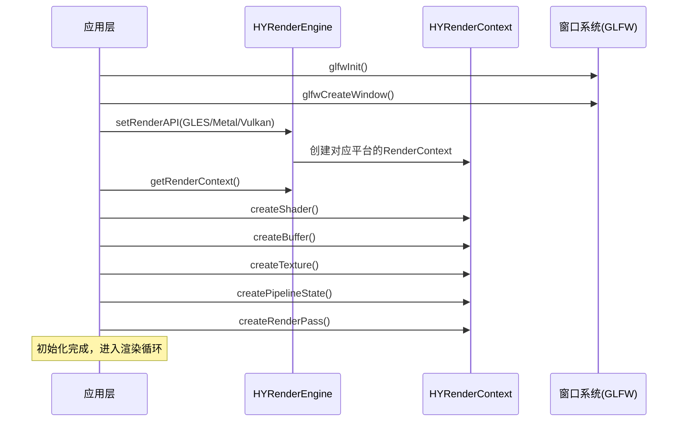
```mermaid
sequenceDiagram
    participant App as 应用层
    participant Engine as HYRenderEngine
    participant Context as HYRenderContext
    participant Window as 窗口系统(GLFW)

    App->>Window: glfwInit()
    App->>Window: glfwCreateWindow()
    App->>Engine: setRenderAPI(GLES/Metal/Vulkan)
    Engine->>Context: 创建对应平台的RenderContext
    App->>Engine: getRenderContext()
    App->>Context: createShader()
    App->>Context: createBuffer()
    App->>Context: createTexture()
    App->>Context: createPipelineState()
    App->>Context: createRenderPass()
    Note over App: 初始化完成，进入渲染循环
```

**关键步骤说明**：

| 步骤 | 操作 | 说明 |
|------|------|------|
| 1 | 初始化窗口系统 | 使用GLFW创建窗口和OpenGL上下文 |
| 2 | 设置渲染API | 通过RenderEngine指定使用的图形API |
| 3 | 创建RenderContext | 根据API类型创建对应的Context实现 |
| 4 | 创建渲染资源 | 通过Context工厂方法创建各类资源 |
| 5 | 进入渲染循环 | 准备就绪，开始每帧渲染 |

### 4.2 渲染帧流程

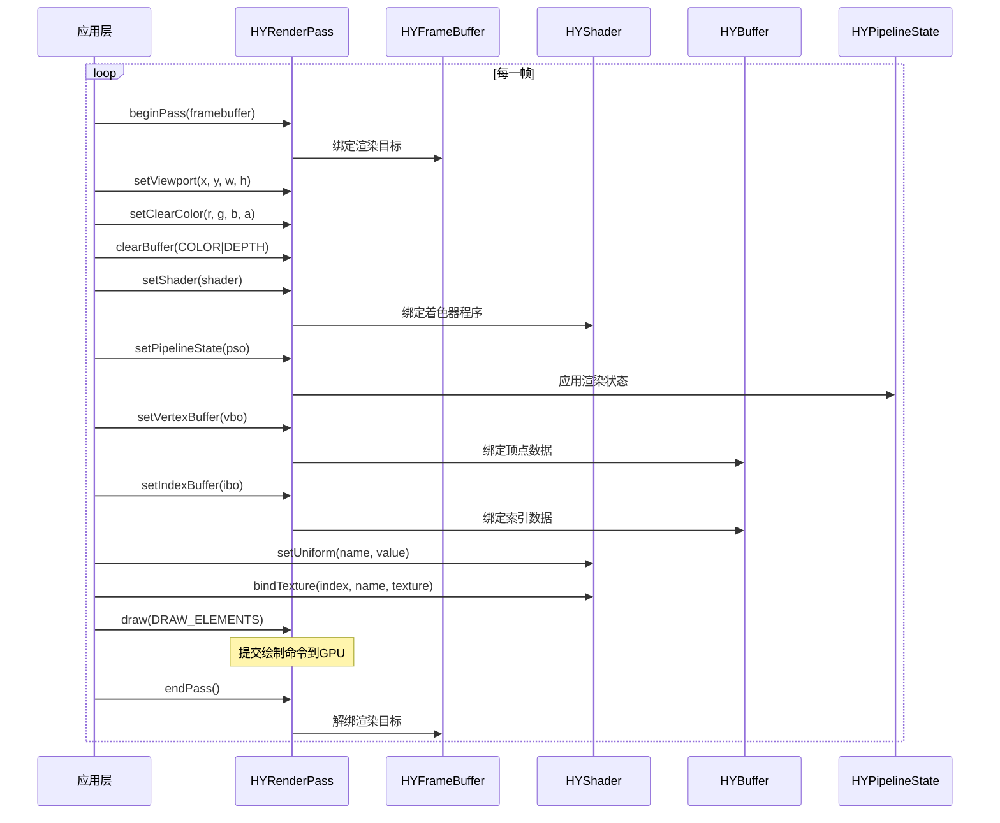
```mermaid
sequenceDiagram
    participant App as 应用层
    participant Pass as HYRenderPass
    participant FBO as HYFrameBuffer
    participant Shader as HYShader
    participant Buffer as HYBuffer
    participant PSO as HYPipelineState

    loop 每一帧
        App->>Pass: beginPass(framebuffer)
        Pass->>FBO: 绑定渲染目标
        App->>Pass: setViewport(x, y, w, h)
        App->>Pass: setClearColor(r, g, b, a)
        App->>Pass: clearBuffer(COLOR|DEPTH)
        
        App->>Pass: setShader(shader)
        Pass->>Shader: 绑定着色器程序
        
        App->>Pass: setPipelineState(pso)
        Pass->>PSO: 应用渲染状态
        
        App->>Pass: setVertexBuffer(vbo)
        Pass->>Buffer: 绑定顶点数据
        
        App->>Pass: setIndexBuffer(ibo)
        Pass->>Buffer: 绑定索引数据
        
        App->>Shader: setUniform(name, value)
        App->>Shader: bindTexture(index, name, texture)
        
        App->>Pass: draw(DRAW_ELEMENTS)
        Note over Pass: 提交绘制命令到GPU
        
        App->>Pass: endPass()
        Pass->>FBO: 解绑渲染目标
    end
```

**关键步骤说明**：

| 步骤 | 操作 | 说明 |
|------|------|------|
| 1 | beginPass | 开始渲染通道，绑定FBO（可选） |
| 2 | setViewport | 设置视口矩形 |
| 3 | setClearColor + clearBuffer | 清除颜色和深度缓冲 |
| 4 | setShader | 绑定着色器程序 |
| 5 | setPipelineState | 应用混合、深度、剔除等状态 |
| 6 | setVertexBuffer/setIndexBuffer | 绑定顶点和索引数据 |
| 7 | setUniform/bindTexture | 设置着色器参数和纹理 |
| 8 | draw | 提交绘制命令 |
| 9 | endPass | 结束渲染通道 |

### 4.3 资源创建流程

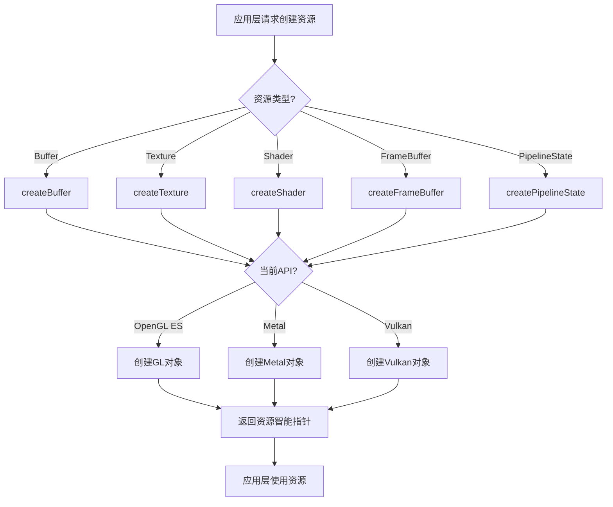
```mermaid
graph TD
    A[应用层请求创建资源] --> B{资源类型?}
    
    B -->|Buffer| C[createBuffer]
    B -->|Texture| D[createTexture]
    B -->|Shader| E[createShader]
    B -->|FrameBuffer| F[createFrameBuffer]
    B -->|PipelineState| G[createPipelineState]
    
    C --> H{当前API?}
    D --> H
    E --> H
    F --> H
    G --> H
    
    H -->|OpenGL ES| I[创建GL对象]
    H -->|Metal| J[创建Metal对象]
    H -->|Vulkan| K[创建Vulkan对象]
    
    I --> L[返回资源智能指针]
    J --> L
    K --> L
    
    L --> M[应用层使用资源]
```

**工厂方法决策表**：

| 资源类型 | OpenGL ES实现 | Metal实现 | Vulkan实现 |
|---------|--------------|----------|-----------|
| Buffer | BufferGL | BufferMtl | BufferVk |
| Texture | TextureGL | TextureMtl | TextureVk |
| Shader | ShaderGL | ShaderMtl | ShaderVk |
| FrameBuffer | FrameBufferGL | FrameBufferMtl | FrameBufferVk |
| PipelineState | PipelineStateGL | PipelineStateMtl | PipelineStateVk |
| RenderPass | RenderPassGL | RenderPassMtl | RenderPassVk |
| Sampler | SamplerGL | SamplerMtl | SamplerVk |
| Fence | FenceGL | FenceMtl | FenceVk |

## 5. 对象优化与扩展

### 5.1 现有资源对象接口优化

基于对display/render目录下现有代码的分析，以下优化建议可以提升引擎的健壮性和扩展性：

#### 5.1.1 HYBuffer接口优化

**问题**：
当前buffer在创建时必须提供完整的layoutElements，但对于Uniform Buffer和索引缓冲区不需要布局信息。

**优化方案**：
将layoutElements设为可选项，只在需要时提供。

**优化后的BufferDesc**：

| 字段 | 类型 | 说明 | 是否必填 |
|------|------|------|----------|
| bindFlags | BufferBindFlag | 绑定类型 | 是 |
| usage | BufferUsage | 使用模式 | 是 |
| size | size_t | 缓冲区大小（字节） | 是 |
| layoutElements | vector\<LayoutElement\> | 数据布局（仅Vertex Buffer需要） | 否 |
| initialData | const void* | 初始化数据指针 | 否 |

**新增接口**：

| 接口方法 | 参数 | 返回值 | 说明 |
|---------|------|--------|------|
| map | offset, size, access | void* | 映射到CPU内存（Vulkan/Metal用） |
| unmap | 无 | void | 取消映射 |
| getSize | 无 | size_t | 获取缓冲区大小 |
| isMapped | 无 | bool | 是否已映射 |

#### 5.1.2 HYTexture接口优化

**问题**：
1. updateTexture参数过多，并且region使用Vec4i不够直观
2. 缺少generateMipmap接口
3. readTexture的colorRange和colorSpace参数应该封装到描述结构体

**优化方案**：

1. 引入TextureRegion结构体明确区域参数
2. 添加generateMipmaps接口
3. 引入TextureReadDesc描述读取配置

**新增TextureRegion结构**：

| 字段 | 类型 | 说明 |
|------|------|------|
| offsetX | uint32_t | X方向偏移 |
| offsetY | uint32_t | Y方向偏移 |
| offsetZ | uint32_t | Z方向偏移（仅3D纹理） |
| width | uint32_t | 区域宽度 |
| height | uint32_t | 区域高度 |
| depth | uint32_t | 区域深度（仅3D纹理） |

**优化后的接口**：

| 接口方法 | 参数 | 返回值 | 说明 |
|---------|------|--------|------|
| updateTexture | level, data, dataFormat, region | void | 使用TextureRegion |
| readTexture | output, readDesc | bool | 使用TextureReadDesc |
| generateMipmaps | 无 | void | 生成Mipmap链 |
| getWidth | mipLevel | uint32_t | 获取指定Mip层宽度 |
| getHeight | mipLevel | uint32_t | 获取指定Mip层高度 |

#### 5.1.3 HYShader接口优化

**问题**：
1. bindTexture和bindUBO在OpenGL中有用，但Vulkan/Metal不需要
2. 缺少统一的资源绑定机制
3. setUniform接口仅适用于OpenGL

**优化方案**：
1. 引入HYShaderResourceBinding抽象层
2. 将资源绑定逻辑移至RenderPass或CommandBuffer
3. Shader主要负责编译和反射

**新增Shader反射接口**：

| 接口方法 | 参数 | 返回值 | 说明 |
|---------|------|--------|------|
| getUniformLocation | name | int32_t | 获取Uniform位置 |
| getAttributeLocation | name | int32_t | 获取Attribute位置 |
| getUniformBlockIndex | name | int32_t | 获取UBO索引 |
| getUniformInfo | name | UniformInfo | 获取Uniform详情 |
| getAttributeInfo | name | AttributeInfo | 获取Attribute详情 |
| getAllUniforms | 无 | vector\<UniformInfo\> | 获取所有Uniform |
| getAllAttributes | 无 | vector\<AttributeInfo\> | 获取所有Attribute |

**UniformInfo结构**：

| 字段 | 类型 | 说明 |
|------|------|------|
| name | string | Uniform名称 |
| type | UniformType | 类型（float, vec3, mat4等） |
| location | int32_t | 位置/绑定点 |
| arraySize | uint32_t | 数组大小（1表示非数组） |

#### 5.1.4 HYRenderPass接口优化

**问题**：
1. 缺少资源绑定的统一接口
2. draw方法缺少必要参数（顶点数、实例数等）
3. 缺少推常量（Push Constants）支持

**优化方案**：
1. draw方法添加详细参数
2. 添加pushConstants接口（Vulkan用）
3. 添加setUniform快捷接口（OpenGL用）

**优化后的draw接口**：

| 接口方法 | 参数 | 说明 |
|---------|------|------|
| drawArrays | vertexStart, vertexCount | 绘制顶点 |
| drawArraysInstanced | vertexStart, vertexCount, instanceCount | 实例化绘制顶点 |
| drawElements | indexCount, indexType, indexOffset | 绘制索引 |
| drawElementsInstanced | indexCount, indexType, indexOffset, instanceCount | 实例化绘制索引 |

**新增资源绑定接口**：

| 接口方法 | 参数 | 说明 |
|---------|------|------|
| bindTexture | slot, texture | 绑定纹理到指定槽位 |
| bindUniformBuffer | slot, buffer, offset, size | 绑定UBO |
| setUniformFloat | name, value | 设置float类Uniform |
| setUniformVec3 | name, value | 设置Vec3类Uniform |
| setUniformMat4 | name, value | 设置Mat4类Uniform |
| pushConstants | stage, offset, size, data | 推送常量数据 |

#### 5.1.5 HYFrameBuffer接口优化

**问题**：
1. 缺少动态调整大小的支持
2. MSAA resolve的逻辑不明确

**优化方案**：
1. 添加resize接口
2. 明确MSAA resolve的目标纹理

**新增接口**：

| 接口方法 | 参数 | 说明 |
|---------|------|------|
| resize | width, height | 调整framebuffer大小 |
| setResolveTarget | idx, texture | 设置MSAA resolve目标 |
| isComplete | 无 | 检查framebuffer是否完整 |

#### 5.1.1 增加命令缓冲抽象层

**问题**：
当前设计中RenderPass直接执行绘制命令，这在OpenGL ES中可行，但在Metal和Vulkan中，命令需要先记录到CommandBuffer再批量提交。

**优化方案**：
增加HYCommandBuffer抽象，将命令记录和提交分离。

**HYCommandBuffer设计**：

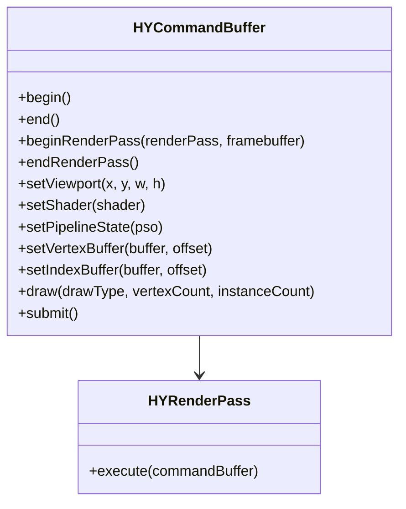
```mermaid
classDiagram
    class HYCommandBuffer {
        +begin()
        +end()
        +beginRenderPass(renderPass, framebuffer)
        +endRenderPass()
        +setViewport(x, y, w, h)
        +setShader(shader)
        +setPipelineState(pso)
        +setVertexBuffer(buffer, offset)
        +setIndexBuffer(buffer, offset)
        +draw(drawType, vertexCount, instanceCount)
        +submit()
    }
    
    class HYRenderPass {
        +execute(commandBuffer)
    }
    
    HYCommandBuffer --> HYRenderPass
```

**平台映射**：

| 平台 | 实现方式 |
|------|---------|
| OpenGL ES | CommandBuffer为空操作，直接调用GL命令 |
| Metal | 封装MTLCommandBuffer和MTLRenderCommandEncoder |
| Vulkan | 封装VkCommandBuffer |

**方案二：统一的矩阵模板**

引入通用Matrix模板：

```
template<typename T, size_t Rows, size_t Cols>
class Matrix {
public:
    T data[Rows][Cols];
    
    T& operator()(size_t row, size_t col);
    Matrix operator*(const Matrix<T, Cols, Rows>& rhs) const;
    Vector<T, Rows> operator*(const Vector<T, Cols>& vec) const;
    Matrix transpose() const;
    T determinant() const;  // 仅方阵
    Matrix inverse() const; // 仅方阵
};

using Mat3f = Matrix<float, 3, 3>;
using Mat4f = Matrix<float, 4, 4>;
```

**方案三：SIMD优化支持**

利用C++17的if constexpr实现条件编译：

```
template<typename T, size_t N>
class Vector {
    // 当N=4且T=float时，使用SIMD优化
    #if defined(__ARM_NEON)
        alignas(16) T data[N];
    #elif defined(__SSE__)
        alignas(16) T data[N];
    #else
        T data[N];
    #endif
    
    Vector operator+(const Vector& rhs) const {
        if constexpr (N == 4 && std::is_same_v<T, float>) {
            // 使用SIMD指令
            #ifdef __ARM_NEON
                // NEON实现
            #elif defined(__SSE__)
                // SSE实现
            #endif
        } else {
            // 通用实现
            Vector result;
            for (size_t i = 0; i < N; ++i) {
                result[i] = data[i] + rhs[i];
            }
            return result;
        }
    }
};
```

**优化后的数学库结构**：

| 类型 | 模板定义 | 说明 |
|------|-----------|------|
| Vector<T, N> | 通用N维向量 | 支持任意类型和维度 |
| Matrix<T, R, C> | 通用R×C矩阵 | 支持任意行列和类型 |
| Quaternion<T> | 四元数 | 旋转表示 |
| Transform<T> | 变换组合 | 位置+旋转+缩放 |

**常用类型别名**：

| 别名 | 定义 | 用途 |
|------|------|------|
| Vec2f | Vector<float, 2> | 2D坐标/UV |
| Vec3f | Vector<float, 3> | 3D位置/法线 |
| Vec4f | Vector<float, 4> | 齐次坐标/颜色 |
| Vec2i | Vector<int32_t, 2> | 像素坐标 |
| Vec4i | Vector<int32_t, 4> | 矩形区域 |
| Mat3f | Matrix<float, 3, 3> | 2D变换/法线矩阵 |
| Mat4f | Matrix<float, 4, 4> | 3D变换 |

#### 5.2.3 增强的数学工具函数

**新增工具类 MathUtils**：

| 函数 | 签名 | 说明 |
|------|------|------|
| lerp | lerp(a, b, t) | 线性插值 |
| slerp | slerp(q1, q2, t) | 球面线性插值（四元数） |
| clamp | clamp(v, min, max) | 限制值范围 |
| smoothstep | smoothstep(edge0, edge1, x) | 平滑过渡 |
| perspective | perspective(fov, aspect, near, far) | 透视投影矩阵 |
| orthographic | ortho(l, r, b, t, n, f) | 正交投影矩阵 |
| lookAt | lookAt(eye, center, up) | 观察矩阵 |
| decompose | decompose(mat, pos, rot, scale) | 分解变换矩阵 |

### 5.3 多线程支持（基于dispatch_queue）

#### 5.3.1 渲染线程模型

**线程分类**：

| 线程类型 | TaskQueue类型 | 优先级 | 说明 |
|---------|-------------|----------|------|
| 渲染线程 | 串行队列（独占） | High | OpenGL上下文线程 |
| 资源加载线程 | 并行队列 | Normal | 异步加载纹理/模型 |
| 逻辑线程 | 串行队列（非独占） | Normal | 游戏逻辑更新 |

**线程创建示例**：

```
// 渲染线程（独占高优先级）
auto renderQueue = TaskQueueFactory::instance()
    .createSerialTaskQueue("RenderThread", 
                          WorkThreadPriority::WTP_High, 
                          true);  // 独占

// 资源加载线程（并行）
auto loaderQueue = TaskQueueFactory::instance()
    .createConcurrencyTaskQueue("ResourceLoader",
                               TaskQueuePriority::TQP_Normal);

// 逻辑线程（串行非独占）
auto logicQueue = TaskQueueFactory::instance()
    .createSerialTaskQueue("GameLogic",
                          WorkThreadPriority::WTP_Normal,
                          false);  // 非独占
```

#### 5.3.2 异步资源加载设计

**设计目标**：
- IO密集型任务（文件读取、图像解码）在工作线程执行
- GPU资源创建（createTexture/createBuffer）在渲染线程执行
- 支持加载进度回调和完成通知

**流程图**：

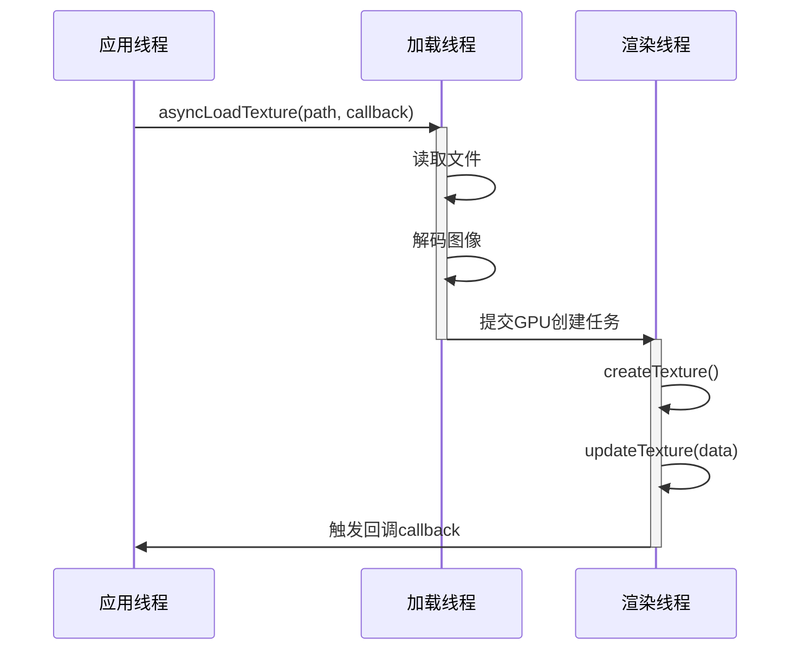
```mermaid
sequenceDiagram
    participant App as 应用线程
    participant Loader as 加载线程
    participant Render as 渲染线程
    
    App->>Loader: asyncLoadTexture(path, callback)
    activate Loader
    Loader->>Loader: 读取文件
    Loader->>Loader: 解码图像
    Loader->>Render: 提交GPU创建任务
    deactivate Loader
    activate Render
    Render->>Render: createTexture()
    Render->>Render: updateTexture(data)
    Render->>App: 触发回调callback
    deactivate Render
```

**ResourceLoader设计**：

| 接口方法 | 参数 | 说明 |
|---------|------|------|
| asyncLoadTexture | path, callback | 异步加载纹理 |
| asyncLoadShader | vertPath, fragPath, callback | 异步加载Shader |
| asyncLoadModel | path, callback | 异步加载模型 |
| cancelLoad | handle | 取消加载任务 |
| getProgress | handle | 获取加载进度 |

**实现示例**：

```
class ResourceLoader {
public:
    using LoadCallback = std::function<void(std::shared_ptr<HYTexture>)>;
    
    void asyncLoadTexture(const std::string& path, LoadCallback callback) {
        // 在加载线程执行IO操作
        mLoaderQueue->async(TaskMark::TM_Resource_Load, [=]() {
            // 读取文件
            auto imageData = loadImageFile(path);
            
            // 切换到渲染线程创廽GPU资源
            mRenderQueue->async(TaskMark::TM_Texture_Create, [=]() {
                auto texture = createTextureFromData(imageData);
                
                // 回调通知
                if (callback) {
                    callback(texture);
                }
            });
        });
    }
    
private:
    TaskQueuePtr mLoaderQueue;  // 加载队列
    TaskQueuePtr mRenderQueue;  // 渲染队列
};
```

#### 5.3.3 TaskGroup应用场景

**场景一：批量纹理加载**

```
auto group = TaskQueueFactory::instance().createTaskGroup();

std::vector<std::string> texturePaths = {"tex1.png", "tex2.png", "tex3.png"};

for (const auto& path : texturePaths) {
    group->async(TaskMark::TM_Resource_Load, [path]() {
        loadTexture(path);
    }, TaskQueuePriority::TQP_Normal);
}

// 等待所有纹理加载完成
group->notify(TaskMark::TM_TaskQueue_Inner, []() {
    LOG("All textures loaded!");
}, renderQueue);
```

**场景二：并行Shader编译**

```
auto group = TaskQueueFactory::instance().createTaskGroup();

std::vector<ShaderDesc> shaderDescs = {...};

for (const auto& desc : shaderDescs) {
    group->asyncQueue(TaskMark::TM_Shader_Compile, [desc]() {
        compileShader(desc);
    }, compileQueue);
}

// 等待所有Shader编译完成
bool success = group->wait(std::chrono::seconds(10));
if (success) {
    LOG("All shaders compiled!");
}
```

#### 5.3.4 线程安全设计

**原则**：

| 规则 | 说明 |
|------|------|
| 渲染命令串行化 | 所有渲染API调用必须在渲染线程 |
| 资源创建线程安全 | GPU资源创建必须在渲染线程 |
| 读取操作可并行 | 资源的Getter方法可在任意线程 |
| 写入操作需加锁 | 资源的Setter需要保护 |

**线程检查宏**：

```
// 检查当前是否在渲染线程
#define CHECK_RENDER_THREAD() \
    assert(TaskQueueFactory::instance().isCurrentThread(mRenderQueue))

// 使用示例
void HYTexture::updateTexture(...) {
    CHECK_RENDER_THREAD();
    // ...
}
```

### 5.4 架构扩展建议

**问题**：
Vulkan需要通过DescriptorSet绑定Uniform、纹理等资源，当前设计缺少此抽象。

**优化方案**：
引入HYDescriptorSet对象，封装资源绑定信息。

**HYDescriptorSet设计**：

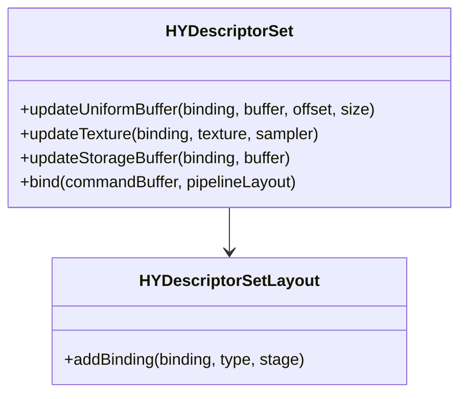
```mermaid
classDiagram
    class HYDescriptorSet {
        +updateUniformBuffer(binding, buffer, offset, size)
        +updateTexture(binding, texture, sampler)
        +updateStorageBuffer(binding, buffer)
        +bind(commandBuffer, pipelineLayout)
    }
    
    class HYDescriptorSetLayout {
        +addBinding(binding, type, stage)
    }
    
    HYDescriptorSet --> HYDescriptorSetLayout
```

**平台映射**：

| 平台 | 实现方式 |
|------|---------|
| OpenGL ES | 空实现，通过glUniform和glBindTexture直接绑定 |
| Metal | 封装ArgumentBuffer |
| Vulkan | 封装VkDescriptorSet和VkDescriptorPool |

#### 5.1.3 统一Shader反射机制

**问题**：
当前ShaderAttribute和ShaderUniform通过手动维护名字到绑定点的映射，容易出错。

**优化方案**：
增加Shader反射接口，自动解析着色器中的变量信息。

**Shader反射接口**：

| 接口方法 | 返回值 | 说明 |
|---------|--------|------|
| getUniformLocation | int32_t | 获取Uniform位置 |
| getAttributeLocation | int32_t | 获取Attribute位置 |
| getUniformBlockBinding | int32_t | 获取UBO绑定点 |
| getTextureBinding | int32_t | 获取纹理绑定点 |

**平台实现**：

| 平台 | 实现方式 |
|------|---------|
| OpenGL ES | 使用glGetUniformLocation、glGetAttribLocation等API |
| Metal | 解析MTLFunction的arguments |
| Vulkan | 使用SPIRV-Reflect库解析SPIR-V字节码 |

#### 5.1.4 优化资源生命周期管理

**问题**：
当前使用shared_ptr管理资源，但缺少延迟销毁机制，可能导致GPU还在使用的资源被提前释放。

**优化方案**：
引入资源回收池和栅栏机制。

**资源回收策略**：

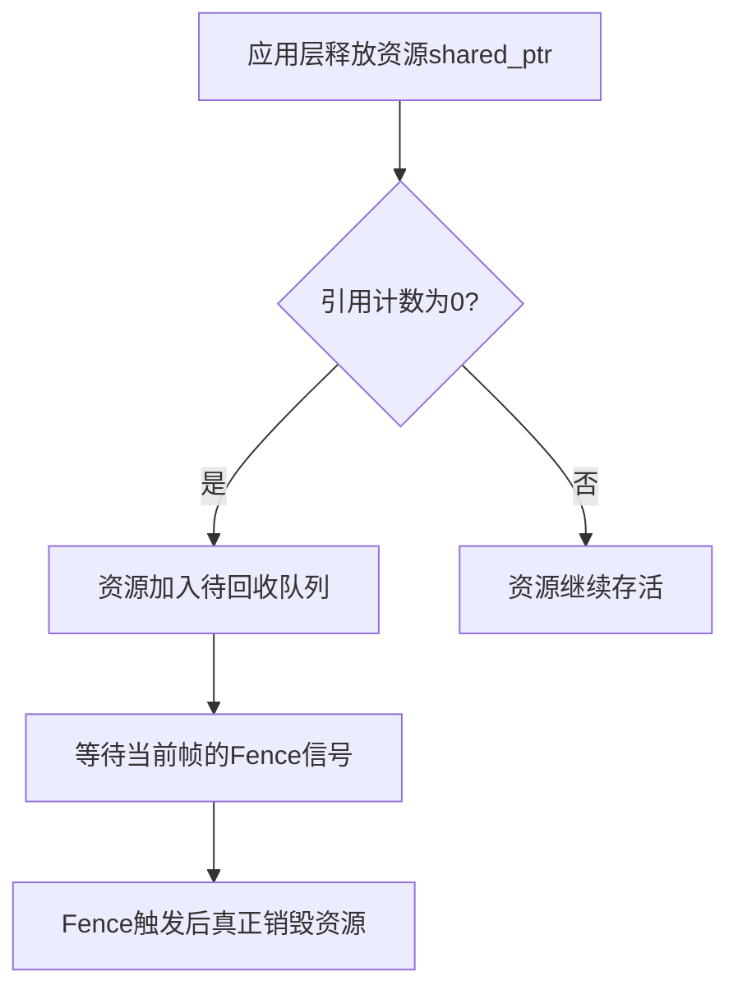
```mermaid
graph TD
    A[应用层释放资源shared_ptr] --> B{引用计数为0?}
    B -->|是| C[资源加入待回收队列]
    C --> D[等待当前帧的Fence信号]
    D --> E[Fence触发后真正销毁资源]
    B -->|否| F[资源继续存活]
```

**实现要点**：

- 每帧创建一个Fence，记录GPU执行进度
- 资源析构时检查关联的Fence状态
- 使用延迟销毁队列管理待回收资源

#### 5.1.5 增加调试工具层

**问题**：
缺少统一的调试信息输出和错误检测机制。

**优化方案**：
增加HYDebugLayer抽象，支持：

- 渲染API调用追踪
- 资源泄漏检测
- 性能统计（Draw Call数量、三角形数量等）
- GPU验证层集成（Vulkan ValidationLayers）

**DebugLayer接口**：

| 接口方法 | 功能 | 说明 |
|---------|------|------|
| enableValidation | 启用API验证 | Vulkan的ValidationLayers |
| trackResourceAllocation | 跟踪资源分配 | 检测资源泄漏 |
| recordDrawCall | 记录绘制调用 | 统计Draw Call |
| dumpFrameInfo | 输出帧信息 | 输出当前帧的渲染统计 |

### 5.2 数学库模板化优化

#### 5.2.1 现有数学库问题

分析display/render/math目录下的数学库，存在以下问题：

1. **类型不统一**：Vec2/Vec3/Vec4都是模板类，但Mat3/Mat4不是模板
2. **代码重复**：各个Vec类有大量重复的操作符重载
3. **缺少通用接口**：无法以统一方式处理不同维度的向量
4. **对齐问题**：注释掉的aligned属性可能影响SIMD优化

#### 5.2.2 优化方案

**方案一：统一的向量模板**

引入通用Vector模板，支持任意维度和类型：

```
template<typename T, size_t N>
class Vector {
public:
    union {
        T data[N];
        // 针对常用维度提供命名访问
        struct { T x, y; };          // N >= 2
        struct { T x, y, z; };       // N >= 3  
        struct { T x, y, z, w; };    // N >= 4
    };
    
    // 通用操作
    T& operator[](size_t i);
    Vector operator+(const Vector& rhs) const;
    Vector operator*(T scalar) const;
    T dot(const Vector& rhs) const;
    T length() const;
    void normalize();
};

// 类型别名
using Vec2f = Vector<float, 2>;
using Vec3f = Vector<float, 3>;
using Vec4f = Vector<float, 4>;
using Vec2i = Vector<int32_t, 2>;
```

#### 5.2.1 引入场景图系统

为了更好地管理渲染对象的层级关系和变换，建议引入场景图（Scene Graph）系统。

**核心对象**：

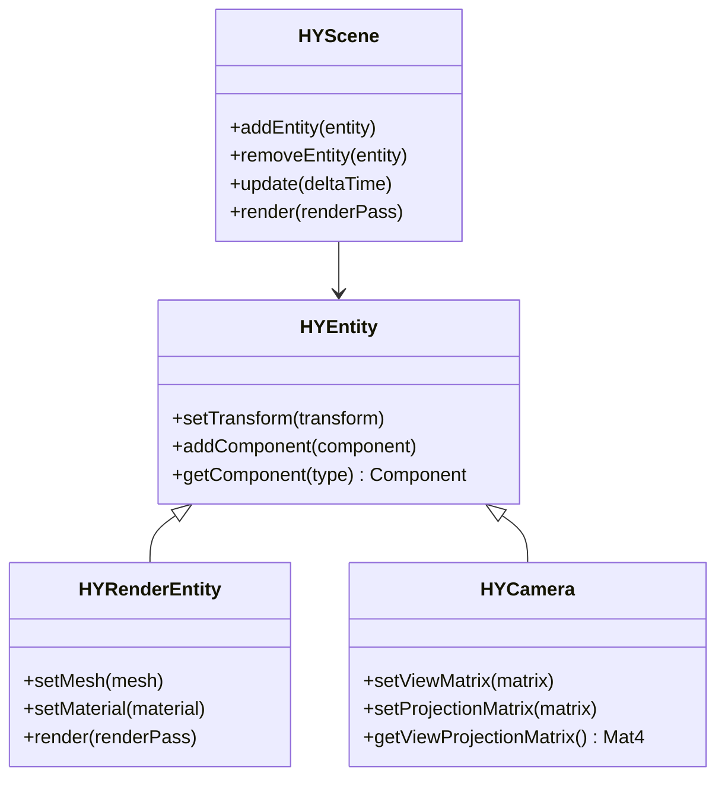
```mermaid
classDiagram
    class HYScene {
        +addEntity(entity)
        +removeEntity(entity)
        +update(deltaTime)
        +render(renderPass)
    }
    
    class HYEntity {
        +setTransform(transform)
        +addComponent(component)
        +getComponent(type) Component
    }
    
    class HYRenderEntity {
        +setMesh(mesh)
        +setMaterial(material)
        +render(renderPass)
    }
    
    class HYCamera {
        +setViewMatrix(matrix)
        +setProjectionMatrix(matrix)
        +getViewProjectionMatrix() Mat4
    }
    
    HYScene --> HYEntity
    HYEntity <|-- HYRenderEntity
    HYEntity <|-- HYCamera
```

**场景渲染流程**：

| 步骤 | 操作 | 说明 |
|------|------|------|
| 1 | Scene::update | 更新场景中所有Entity的逻辑 |
| 2 | Camera::updateMatrix | 更新相机的ViewProjection矩阵 |
| 3 | Scene::render | 遍历所有RenderEntity |
| 4 | RenderEntity::render | 设置Transform Uniform并绘制 |

#### 5.2.2 材质系统

**问题**：
当前Shader、Texture、PipelineState分散管理，缺少统一的材质抽象。

**优化方案**：
引入HYMaterial对象，封装着色器、纹理、参数等。

**Material设计**：

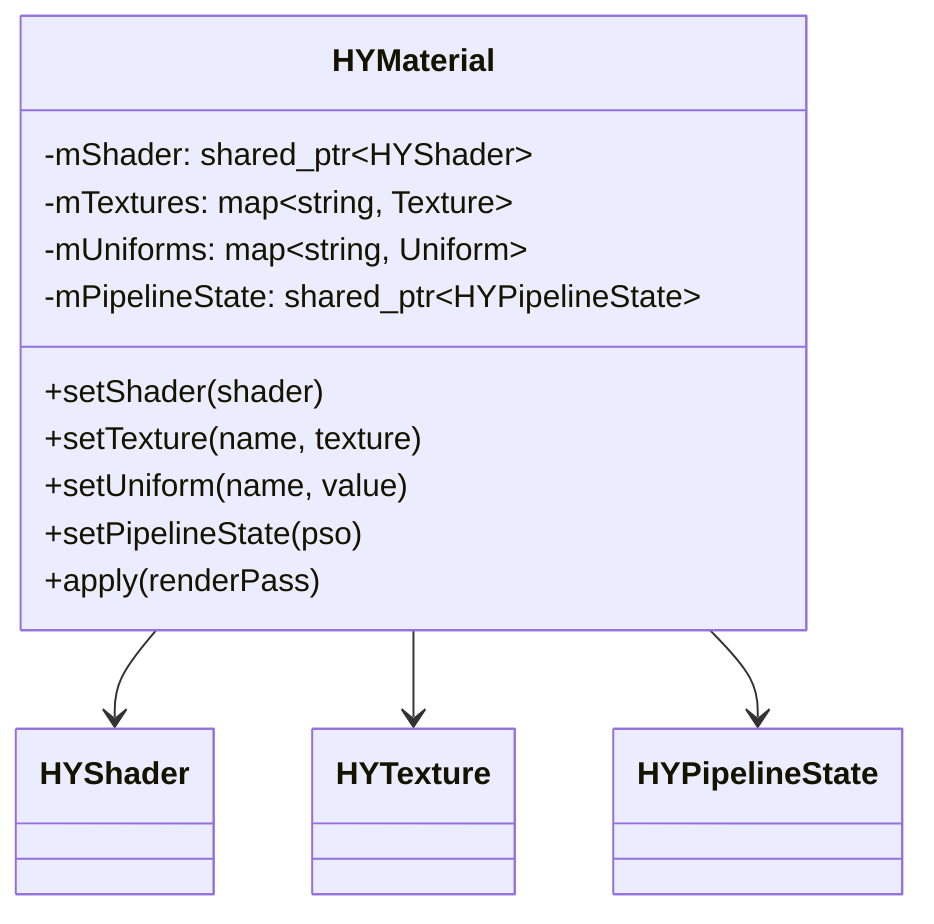
```mermaid
classDiagram
    class HYMaterial {
        -mShader: shared_ptr~HYShader~
        -mTextures: map~string, Texture~
        -mUniforms: map~string, Uniform~
        -mPipelineState: shared_ptr~HYPipelineState~
        +setShader(shader)
        +setTexture(name, texture)
        +setUniform(name, value)
        +setPipelineState(pso)
        +apply(renderPass)
    }
    
    HYMaterial --> HYShader
    HYMaterial --> HYTexture
    HYMaterial --> HYPipelineState
```

**Material使用流程**：

| 步骤 | 操作 | 说明 |
|------|------|------|
| 1 | material.setShader(shader) | 设置着色器 |
| 2 | material.setTexture("diffuse", tex) | 绑定漫反射纹理 |
| 3 | material.setUniform("color", vec4) | 设置颜色参数 |
| 4 | material.apply(renderPass) | 应用到RenderPass |

#### 5.2.3 异步资源加载

**问题**：
当前资源创建在主线程阻塞执行，加载大量纹理或模型时会卡顿。

**优化方案**：
引入异步资源加载机制。

**异步加载流程**：

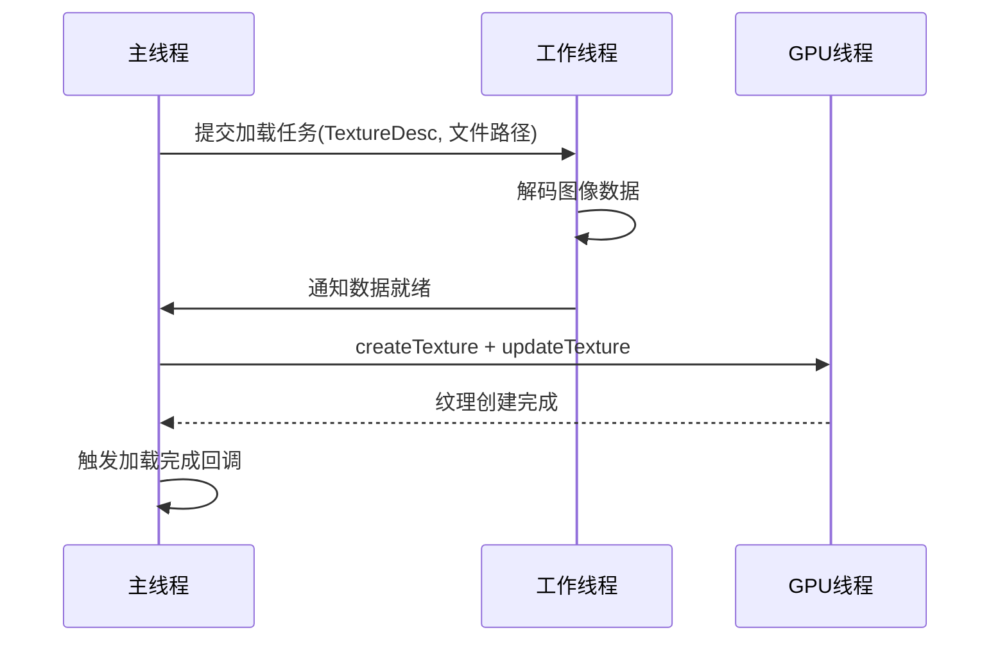
```mermaid
sequenceDiagram
    participant Main as 主线程
    participant Worker as 工作线程
    participant GPU as GPU线程
    
    Main->>Worker: 提交加载任务(TextureDesc, 文件路径)
    Worker->>Worker: 解码图像数据
    Worker->>Main: 通知数据就绪
    Main->>GPU: createTexture + updateTexture
    GPU-->>Main: 纹理创建完成
    Main->>Main: 触发加载完成回调
```

**实现要点**：

- 使用线程池处理IO密集型任务（文件读取、图像解码）
- GPU资源创建必须在渲染线程执行
- 使用Future/Promise模式通知加载完成

## 6. macOS Demo实现流程

### 6.1 Demo目标

基于GLFW在macOS平台实现一个简单的渲染Demo，展示引擎的基本功能：

- 创建窗口和OpenGL上下文
- 使用引擎渲染一个带纹理的旋转立方体
- 支持键盘输入控制相机视角
- 显示FPS统计

### 6.2 Demo架构

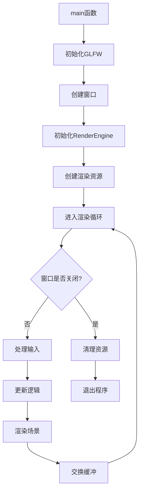
```mermaid
graph TD
    A[main函数] --> B[初始化GLFW]
    B --> C[创建窗口]
    C --> D[初始化RenderEngine]
    D --> E[创建渲染资源]
    E --> F[进入渲染循环]
    F --> G{窗口是否关闭?}
    G -->|否| H[处理输入]
    H --> I[更新逻辑]
    I --> J[渲染场景]
    J --> K[交换缓冲]
    K --> F
    G -->|是| L[清理资源]
    L --> M[退出程序]
```

### 6.3 Demo核心流程

#### 6.3.1 窗口初始化

**步骤说明**：

| 步骤 | 操作 | 说明 |
|------|------|------|
| 1 | glfwInit() | 初始化GLFW库 |
| 2 | glfwWindowHint() | 设置OpenGL版本和Profile |
| 3 | glfwCreateWindow() | 创建窗口和OpenGL上下文 |
| 4 | glfwMakeContextCurrent() | 激活上下文 |
| 5 | 加载OpenGL函数指针 | 使用GLAD或GLEW |

**窗口配置参数**：

| 参数 | 值 | 说明 |
|------|-----|------|
| GLFW_CONTEXT_VERSION_MAJOR | 3 | OpenGL主版本号 |
| GLFW_CONTEXT_VERSION_MINOR | 3 | OpenGL次版本号 |
| GLFW_OPENGL_PROFILE | GLFW_OPENGL_CORE_PROFILE | 核心模式 |
| GLFW_OPENGL_FORWARD_COMPAT | GL_TRUE | macOS兼容性 |

#### 6.3.2 渲染资源创建

**Shader创建流程**：

| 步骤 | 操作 | 说明 |
|------|------|------|
| 1 | 准备GLSL代码字符串 | 顶点着色器和片段着色器 |
| 2 | 创建ShaderDesc | 填充着色器描述 |
| 3 | context->createShader(desc) | 创建Shader对象 |
| 4 | shader->doInit() | 编译链接着色器 |

**顶点数据准备**：

立方体顶点数据结构：

| 数据 | 格式 | 说明 |
|------|------|------|
| 位置 | Vec3（x, y, z） | 顶点坐标 |
| 法线 | Vec3（nx, ny, nz） | 法向量 |
| 纹理坐标 | Vec2（u, v） | UV坐标 |

立方体拓扑：

- 顶点数量：24（每面4个顶点，共6面）
- 索引数量：36（每面2个三角形，共6面）

**Buffer创建流程**：

| 步骤 | 操作 | 说明 |
|------|------|------|
| 1 | 准备顶点数据数组 | float数组包含位置、法线、UV |
| 2 | 创建BufferDesc | 设置BIND_VERTEX_BUFFER |
| 3 | context->createBuffer(desc) | 创建VBO |
| 4 | buffer->updateData(data, 0, size) | 上传顶点数据 |
| 5 | 重复2-4创建IBO | 使用BIND_INDEX_BUFFER |

**Texture创建流程**：

| 步骤 | 操作 | 说明 |
|------|------|------|
| 1 | 使用stb_image加载图像文件 | 解码为RGBA数据 |
| 2 | 创建TextureDesc | 设置宽高、格式为RGBA8 |
| 3 | context->createTexture(desc) | 创建Texture对象 |
| 4 | texture->updateTexture(...) | 上传像素数据 |
| 5 | 创建SamplerDesc并设置过滤模式 | LINEAR + MIPMAP |
| 6 | texture->setSampler(sampler) | 绑定采样器 |

**PipelineState创建**：

| 配置项 | 设置值 | 说明 |
|-------|--------|------|
| blendEnable | false | 不透明物体不需要混合 |
| depthTestEnable | true | 启用深度测试 |
| depthWriteEnable | true | 写入深度缓冲 |
| cullMode | BACK | 背面剔除 |
| primitive | TRIANGLES | 三角形图元 |

#### 6.3.3 渲染循环实现

**每帧渲染步骤**：


```mermaid
graph LR
    A[glfwPollEvents] --> B[计算deltaTime]
    B --> C[更新相机矩阵]
    C --> D[renderPass.beginPass]
    D --> E[clearBuffer]
    E --> F[setShader]
    F --> G[setPipelineState]
    G --> H[setVertexBuffer]
    H --> I[setIndexBuffer]
    I --> J[setUniform MVP]
    J --> K[bindTexture]
    K --> L[draw DRAW_ELEMENTS]
    L --> M[endPass]
    M --> N[glfwSwapBuffers]
```

**矩阵计算**：

| 矩阵 | 计算方式 | 说明 |
|------|---------|------|
| Model | 旋转矩阵（每帧递增角度） | 物体变换 |
| View | lookAt(eye, center, up) | 相机变换 |
| Projection | perspective(fov, aspect, near, far) | 透视投影 |
| MVP | Projection × View × Model | 最终变换矩阵 |

**输入处理**：

| 按键 | 功能 | 实现 |
|------|------|------|
| W/S | 前后移动相机 | 修改camera.position.z |
| A/D | 左右移动相机 | 修改camera.position.x |
| ESC | 退出程序 | glfwSetWindowShouldClose |

#### 6.3.4 资源清理

**清理步骤**：

| 步骤 | 操作 | 说明 |
|------|------|------|
| 1 | 释放所有shared_ptr资源 | 自动调用析构函数 |
| 2 | glfwDestroyWindow() | 销毁窗口 |
| 3 | glfwTerminate() | 清理GLFW |

### 6.4 Demo项目结构

```
demo/
├── CMakeLists.txt
├── main.cpp
├── shaders/
│   ├── cube.vert.glsl
│   └── cube.frag.glsl
├── textures/
│   └── container.jpg
└── utils/
    ├── Camera.h
    ├── Camera.cpp
    ├── MeshGenerator.h
    └── MeshGenerator.cpp
```

**文件职责**：

| 文件 | 职责 | 说明 |
|------|------|------|
| main.cpp | 主程序入口 | GLFW初始化、渲染循环 |
| Camera.h/cpp | 相机类 | 封装View矩阵计算和输入处理 |
| MeshGenerator.h/cpp | 网格生成器 | 生成立方体、球体等几何体 |
| cube.vert.glsl | 顶点着色器 | MVP变换 |
| cube.frag.glsl | 片段着色器 | 纹理采样 |

### 6.5 Demo扩展功能

**可选扩展**：

| 功能 | 实现方式 | 难度 |
|------|---------|------|
| 多个立方体渲染 | 实例化绘制或多次Draw Call | 简单 |
| 光照计算 | 在片段着色器中实现Blinn-Phong | 中等 |
| 阴影映射 | 两个RenderPass（深度Pass + 主Pass） | 困难 |
| 后处理特效 | 渲染到FBO，再用屏幕四边形绘制 | 中等 |

## 7. 设计模式应用

### 7.1 工厂模式（Factory Pattern）

**应用场景**：HYRenderContext作为抽象工厂，创建不同平台的渲染资源。

**优势**：
- 客户端代码无需关心具体平台实现
- 通过切换RenderContext子类即可切换渲染后端
- 便于添加新平台支持

**类图关系**：

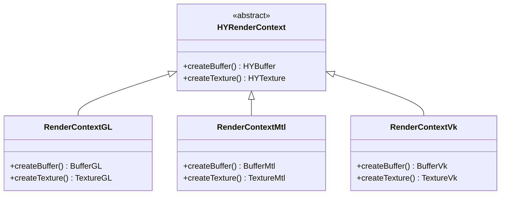
```mermaid
classDiagram
    class HYRenderContext {
        <<abstract>>
        +createBuffer() HYBuffer
        +createTexture() HYTexture
    }
    
    class RenderContextGL {
        +createBuffer() BufferGL
        +createTexture() TextureGL
    }
    
    class RenderContextMtl {
        +createBuffer() BufferMtl
        +createTexture() TextureMtl
    }
    
    class RenderContextVk {
        +createBuffer() BufferVk
        +createTexture() TextureVk
    }
    
    HYRenderContext <|-- RenderContextGL
    HYRenderContext <|-- RenderContextMtl
    HYRenderContext <|-- RenderContextVk
```

### 7.2 策略模式（Strategy Pattern）

**应用场景**：HYPipelineState封装不同的渲染状态配置策略。

**优势**：
- 将渲染状态配置与渲染逻辑分离
- 可预先创建多个PipelineState并复用
- 便于在运行时切换渲染策略

**使用示例**：

| 场景 | PipelineState配置 |
|------|------------------|
| 不透明物体渲染 | blend=false, depth=true, cull=BACK |
| 半透明物体渲染 | blend=true, depth=false, cull=NONE |
| 天空盒渲染 | blend=false, depth=true(LEQUAL), cull=FRONT |

### 7.3 单例模式（Singleton Pattern）

**应用场景**：HYRenderEngine全局唯一实例。

**优势**：
- 确保全局只有一个渲染引擎
- 提供全局访问点
- 延迟初始化，节省资源

**实现方式**：
继承自HESingleton模板类，线程安全的懒汉式单例。

### 7.4 命令模式（Command Pattern）

**应用场景**：HYRenderPass和未来的HYCommandBuffer。

**优势**：
- 将渲染命令封装为对象
- 支持命令队列和批量提交
- 便于实现多线程命令记录

**命令抽象**：

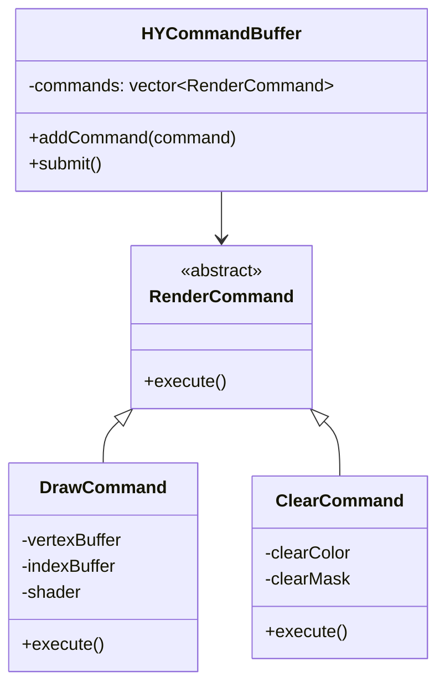
```mermaid
classDiagram
    class RenderCommand {
        <<abstract>>
        +execute()
    }
    
    class DrawCommand {
        -vertexBuffer
        -indexBuffer
        -shader
        +execute()
    }
    
    class ClearCommand {
        -clearColor
        -clearMask
        +execute()
    }
    
    class HYCommandBuffer {
        -commands: vector~RenderCommand~
        +addCommand(command)
        +submit()
    }
    
    RenderCommand <|-- DrawCommand
    RenderCommand <|-- ClearCommand
    HYCommandBuffer --> RenderCommand
```

### 7.5 适配器模式（Adapter Pattern）

**应用场景**：将不同平台的原生API适配到统一接口。

**优势**：
- 隐藏平台差异
- 保持接口一致性
- 便于平台迁移

**适配示例**：

| 统一接口 | OpenGL ES适配 | Metal适配 | Vulkan适配 |
|---------|--------------|----------|-----------|
| Buffer::updateData | glBufferSubData | memcpy到MTLBuffer | vkCmdCopyBuffer |
| Texture::bindSampler | glBindSampler | 无需操作（采样器在PSO中） | vkCmdBindDescriptorSets |
| RenderPass::draw | glDrawElements | drawIndexedPrimitives | vkCmdDrawIndexed |

## 8. 测试策略

### 8.1 单元测试

**测试对象**：各抽象对象的功能正确性。

**测试框架**：Google Test

**测试用例示例**：

| 测试模块 | 测试用例 | 验证点 |
|---------|---------|--------|
| HYBuffer | testBufferCreate | 缓冲区创建成功 |
| HYBuffer | testBufferUpdate | 数据上传正确 |
| HYTexture | testTextureCreate | 纹理创建成功 |
| HYTexture | testTextureUpdate | 像素数据上传正确 |
| HYShader | testShaderCompile | 着色器编译成功 |
| HYShader | testUniformSet | Uniform设置正确 |

### 8.2 集成测试

**测试对象**：完整的渲染流程。

**测试场景**：

| 场景 | 测试内容 | 预期结果 |
|------|---------|---------|
| 基础三角形渲染 | 创建VBO，绘制三角形 | 屏幕显示正确的三角形 |
| 纹理贴图 | 创建纹理并应用到矩形 | 纹理正确映射 |
| 深度测试 | 绘制两个重叠的物体 | 遮挡关系正确 |
| 混合模式 | 绘制半透明物体 | Alpha混合正确 |

### 8.3 性能测试

**测试指标**：

| 指标 | 说明 | 目标值 |
|------|------|--------|
| FPS | 帧率 | ≥60 |
| Draw Call数量 | 每帧绘制调用次数 | 统计并优化 |
| GPU占用率 | GPU使用率 | <80% |
| 内存占用 | 渲染资源内存占用 | 监控泄漏 |

## 9. dispatch_queue多线程API说明

### 9.1 TaskQueue接口分析

**TaskQueue特性**：

| 特性 | 说明 |
|------|------|
| 队列类型 | 支持串行队列和并行队列 |
| 任务执行 | 异步（async）、同步（sync）、延时（after） |
| 任务封装 | TaskOperator或Lambda函数 |
| 任务标记 | TaskMark用于性能统计和追踪 |
| 超时控制 | sync支持超时参数 |

**核心API**：

```
// 异步执行任务
void async(const TaskOperatorPtr& task);
void async(const TaskMark& mark, Func&& func);

// 同步执行任务（阻塞等待）
void sync(const TaskOperatorPtr& task, timeout = -1);
void sync(const TaskMark& mark, Func&& func, timeout = -1);

// 延时执行任务
void after(milliseconds delay, const TaskOperatorPtr& task);
void after(const TaskMark& mark, milliseconds delay, Func&& func);
```

**在渲染引擎中的应用**：

| 应用场景 | 队列类型 | API | 示例 |
|---------|---------|-----|------|
| 渲染命令提交 | 串行独占 | async | renderQueue->async(mark, []{drawCall()}) |
| 资源上传 | 串行独占 | sync | renderQueue->sync(mark, []{uploadBuffer()}) |
| 异步纹理加载 | 并行 | async | loaderQueue->async(mark, []{loadTexture()}) |
| 延迟资源释放 | 串行 | after | resourceQueue->after(mark, 100ms, []{release()}) |

### 9.2 TaskGroup接口分析

**TaskGroup特性**：

| 特性 | 说明 |
|------|------|
| 任务组合 | 将多个任务组织成一个逻辑单元 |
| 并行执行 | 组内任务可并行到不同队列 |
| 完成通知 | notify在所有任务完成后回调 |
| 等待机制 | wait阻塞等待所有任务完成 |

**核心API**：

```
// 在指定队列执行任务
void asyncQueue(const TaskOperatorPtr& task, const TaskQueuePtr& queue);

// 在全局队列执行任务
void async(const TaskOperatorPtr& task, TaskQueuePriority priority);

// 所有任务完成后通知
void notify(const TaskOperatorPtr& task, const TaskQueuePtr& queue);

// 等待所有任务完成
bool wait(milliseconds timeout = -1);
```

**在渲染引擎中的应用**：

| 应用场景 | 用法 | 说明 |
|---------|------|------|
| 批量Shader编译 | group->async() | 并行编译多个Shader |
| 多纹理加载 | group->asyncQueue() | 在加载队列中并行加载 |
| 等待加载完成 | group->wait() | 阻塞直到所有资源就绪 |
| 加载完成回调 | group->notify() | 在渲染队列中初始化GPU资源 |

### 9.3 TaskQueueFactory接口分析

**工厂方法**：

```
// 创建串行队列
TaskQueuePtr createSerialTaskQueue(
    const string& label,           // 队列名称
    WorkThreadPriority priority,   // 线程优先级
    bool isExclusive);            // 是否独占线程

// 创建并行队列
TaskQueuePtr createConcurrencyTaskQueue(
    const string& label,
    TaskQueuePriority priority);

// 获取全局并行队列
TaskQueuePtr& globalConcurrencyQueue(TaskQueuePriority priority);

// 获取全局串行队列
TaskQueuePtr& globalSerialQueue();

// 创建任务组
TaskGroupPtr createTaskGroup();
```

**优先级说明**：

| 优先级类型 | 枚举值 | 说明 |
|-----------|--------|------|
| WorkThreadPriority | Low/Normal/High | 用于独占串行队列，影响线程优先级 |
| TaskQueuePriority | Low/Normal/High | 用于并行队列，影响任务执行顺序 |

**在渲染引擎中的队列配置**：

| 队列名称 | 类型 | 优先级 | 独占 | 用途 |
|---------|------|--------|------|------|
| RenderThread | 串行 | High | 是 | OpenGL上下文线程，所有渲染命令 |
| ResourceLoader | 并行 | Normal | - | 异步资源加载（IO、解码） |
| ShaderCompiler | 并行 | Normal | - | Shader编译 |
| LogicThread | 串行 | Normal | 否 | 游戏逻辑更新 |

### 9.4 TaskOperator接口分析

**任务封装**：

```
class TaskOperator {
    using CallBack = std::function<void(const std::shared_ptr<TaskOperator>&)>;
    
    // 构造函数
    explicit TaskOperator(TaskMark mark = TM_TaskQueue_Inner);
    explicit TaskOperator(TaskMark mark, CallBack callback);
    
    // 执行任务
    virtual void operator()();
    
    // 用户数据
    void setUserData(const shared_ptr<void>& userData);
    template<typename T> shared_ptr<T> userData() const;
    
    // 性能统计
    uint64_t taskRunDuration() const;   // 任务执行耗时
    uint64_t taskWaitDuration() const;  // 任务等待耗时
    string taskCostInfo() const;        // 性能信息字符串
};
```

**TaskMark枚举扩展**：

针对渲染引擎，建议扩展TaskMark枚举：

```
enum class TaskMark : uint16_t {
    // 渲染相关
    TM_Render_Draw = 500,
    TM_Render_Submit,
    TM_Render_Present,
    TM_Render_UpdateBuffer,
    TM_Render_UpdateTexture,
    
    // 资源加载
    TM_Resource_Load = 600,
    TM_Resource_LoadTexture,
    TM_Resource_LoadModel,
    TM_Resource_LoadShader,
    
    // Shader编译
    TM_Shader_Compile = 700,
    TM_Shader_Link,
    TM_Shader_Reflect,
    
    // 其他
    TM_Logic_Update = 800,
    TM_Physics_Step,
};
```

### 9.5 dispatch_queue的优化建议

**建议一：增加队列状态查询**

```
class TaskQueue {
    // 建议新增
    size_t getPendingTaskCount() const;  // 获取待执行任务数
    bool isCurrentThread() const;        // 判断是否在当前队列线程
    bool isEmpty() const;                // 队列是否为空
};
```

**用途**：
- getPendingTaskCount：监控队列负载
- isCurrentThread：线程安全检查
- isEmpty：判断是否需要等待

**建议二：支持任务取消**

```
class TaskQueue {
    // 建议新增
    TaskHandle async(const TaskMark& mark, Func&& func);
    void cancel(TaskHandle handle);  // 取消未执行的任务
};
```

**用途**：
- 取消不再需要的资源加载任务
- 避免无效的计算开销

**建议三：优先级动态调整**

```
class TaskQueue {
    // 建议新增
    void adjustPriority(TaskHandle handle, TaskQueuePriority newPriority);
};
```

**用途**：
- 根据运行时需求动态调整任务优先级
- 优化资源加载策略

## 10. Shader编译链路分析与优化

### 10.1 当前Shader编译链路分析

#### 10.1.1 现有编译流程

**编译工具链**：

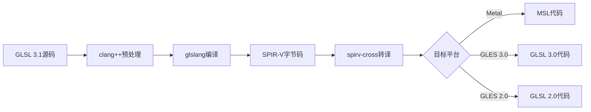
```mermaid
graph LR
    A[GLSL 3.1源码] --> B[clang++预处理]
    B --> C[glslang编译]
    C --> D[SPIR-V字节码]
    D --> E[spirv-cross转译]
    E --> F{目标平台}
    F -->|Metal| G[MSL代码]
    F -->|GLES 3.0| H[GLSL 3.0代码]
    F -->|GLES 2.0| I[GLSL 2.0代码]
```

**工具链组件**：

| 工具 | 版本要求 | 作用 | 说明 |
|------|---------|------|------|
| clang++ | - | C++预处理器 | 处理#include宏，展开头文件 |
| glslang | - | GLSL编译器 | 将GLSL 3.1编译为SPIR-V |
| spirv-cross | - | SPIR-V转译器 | 将SPIR-V转为目标平台着色器 |

**编译流程步骤**：

| 步骤 | 操作 | 输入 | 输出 | 说明 |
|------|------|------|------|------|
| 1 | 预处理 | .hpp文件 | .i文件 | 去除#include、注释，保留#extension |
| 2 | 字符串提取 | .i文件 | vert/frag字符串 | 解析C++字符串字面量 |
| 3 | 写入临时文件 | shader字符串 | .vert/.frag文件 | 添加#version 310 es |
| 4 | 编译SPIR-V | .vert/.frag | .spv文件 | glslang -G编译 |
| 5 | 转译目标平台 | .spv文件 | .metal/.vert/.frag | spirv-cross转译 |
| 6 | 合并生成头文件 | 转译后文件 | .hpp头文件 | 重新封装为C++字符串 |

#### 10.1.2 链路可行性分析

**优势**：

| 优势项 | 说明 |
|--------|------|
| 单一源码 | 只需维护GLSL 3.1版本，自动生成其他平台代码 |
| SPIR-V中间层 | SPIR-V作为中间表示，支持多种目标平台 |
| 自动化 | 脚本化编译流程，减少人工错误 |
| 扩展性 | 通过修改spirv-cross参数可支持更多平台 |

**存在的问题**：

| 问题类型 | 具体问题 | 影响 |
|---------|---------|------|
| **API兼容性** | GLES 3.1 → GLES 3.0降级可能丢失特性 | 部分高级特性不可用 |
| **OES纹理处理** | samplerExternalOES需手动替换为sampler2D | Android OES纹理兼容性问题 |
| **Metal入口函数** | 使用--rename-entry-point统一命名 | 需要额外处理入口函数映射 |
| **精度限定符** | GLES需要明确precision，Metal不需要 | 可能导致精度不一致 |
| **扩展指令** | #extension指令需要平台特定处理 | GLES扩展在Metal中无对应 |

**关键发现**：

根据代码分析和PDF文档：

1. **SPIR-V作为桥梁是可行的**：
   - glslang可以正确将GLSL 3.1编译为SPIR-V
   - spirv-cross支持SPIR-V到MSL、GLSL 3.0/2.0的转换
   - 这是Khronos官方推荐的跨平台方案

2. **需要处理平台差异**：
   - OES纹理：脚本已实现自动替换samplerExternalOES
   - 精度限定符：GLES需要显式声明precision
   - 内置变量：gl_FragColor vs 自定义out变量

3. **版本兼容性**：
   - GLES 3.1 → 3.0：特性兼容性高
   - GLES 3.1 → 2.0：需要降级处理（compute shader等不支持）

#### 10.1.3 Vulkan支持分析

**Vulkan Shader编译路径**：

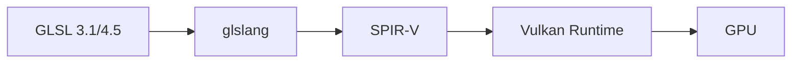
```mermaid
graph LR
    A[GLSL 3.1/4.5] --> B[glslang]
    B --> C[SPIR-V]
    C --> D[Vulkan Runtime]
    D --> E[GPU]
```

**Vulkan优势**：

| 优势 | 说明 |
|------|------|
| 原生SPIR-V | Vulkan直接使用SPIR-V，无需转译 |
| 性能优化 | 离线编译SPIR-V，运行时无编译开销 |
| 验证完善 | SPIR-V-Tools提供完整的验证工具链 |

**实现方式**：

```
# Vulkan不需要spirv-cross，直接使用SPIR-V
glslang -V shader.vert -o shader.vert.spv
glslang -V shader.frag -o shader.frag.spv
```

### 10.2 Shader编译链路优化方案

#### 10.2.1 优化目标

| 目标 | 说明 |
|------|------|
| 去除GLES 2.0支持 | 简化编译流程，专注GLES 3.0+ |
| 增强Vulkan支持 | 直接输出SPIR-V字节码 |
| 改进错误处理 | 提供详细的编译错误信息 |
| 缓存机制 | 避免重复编译未修改的shader |
| 验证机制 | 自动验证生成的shader正确性 |

#### 10.2.2 优化后的编译流程

**新的编译架构**：

```mermaid
graph TD
    A[GLSL 4.5源码] --> B{编译目标}
    
    B -->|GLES 3.0/3.1| C[glslang编译]
    C --> D[SPIR-V]
    D --> E[spirv-cross]
    E --> F[GLSL ES 3.0]
    F --> G[GLSL验证]
    G --> H[生成GLES头文件]
    
    B -->|Metal| C
    D --> I[spirv-cross MSL]
    I --> J[Metal编译验证]
    J --> K[生成Metal头文件]
    
    B -->|Vulkan| C
    D --> L[SPIR-V优化]
    L --> M[SPIR-V验证]
    M --> N[生成SPIR-V二进制]
```

**优化点说明**：

| 优化项 | 优化内容 | 收益 |
|--------|---------|------|
| 源码版本 | 从GLSL 3.1升级到GLSL 4.5 | 支持更多现代特性 |
| 去除GLES 2.0 | 不再生成GLES 2.0代码 | 简化流程，减少维护成本 |
| 增加验证步骤 | spirv-val验证SPIR-V | 提前发现错误 |
| Shader缓存 | 基于文件MD5的增量编译 | 加速编译过程 |
| 错误提示 | 捕获并格式化编译错误 | 提升开发体验 |

#### 10.2.3 优化后的脚本设计

**新的编译参数**：

```bash
# 编译GLES 3.0
python shader_build.py --target gles30 \
    --input shaders/source \
    --output shaders/gles30 \
    --validate

# 编译Metal
python shader_build.py --target metal \
    --input shaders/source \
    --output shaders/metal \
    --metal-version 2.3 \
    --validate

# 编译Vulkan
python shader_build.py --target vulkan \
    --input shaders/source \
    --output shaders/spirv \
    --optimize \
    --validate

# 编译所有平台
python shader_build.py --target all \
    --input shaders/source \
    --cache .shader_cache
```

**新增功能**：

| 功能 | 参数 | 说明 |
|------|------|------|
| 验证 | --validate | 使用spirv-val和平台编译器验证 |
| 优化 | --optimize | 使用spirv-opt优化SPIR-V |
| 缓存 | --cache DIR | 启用增量编译缓存 |
| 并行编译 | --jobs N | 多线程并行编译 |
| Metal版本 | --metal-version X.Y | 指定Metal着色语言版本 |
| 详细日志 | --verbose | 输出详细编译信息 |

#### 10.2.4 Shader目录结构优化

**推荐的目录结构**：

```
shaders/
├── source/                      # 源码目录（GLSL 4.5）
│   ├── common/                  # 公共头文件
│   │   ├── common.glsl
│   │   ├── lighting.glsl
│   │   └── utils.glsl
│   ├── basic/
│   │   ├── basic.vert
│   │   └── basic.frag
│   ├── pbr/
│   │   ├── pbr.vert
│   │   └── pbr.frag
│   └── postprocess/
│       ├── bloom.frag
│       └── tonemap.frag
├── compiled/                    # 编译输出目录
│   ├── gles30/                  # GLES 3.0
│   │   ├── basic.vert.hpp
│   │   ├── basic.frag.hpp
│   │   └── ...
│   ├── metal/                   # Metal
│   │   ├── basic.vert.metal
│   │   ├── basic.frag.metal
│   │   └── ...
│   └── spirv/                   # Vulkan SPIR-V
│       ├── basic.vert.spv
│       ├── basic.frag.spv
│       └── ...
└── .shader_cache/               # 编译缓存
    └── cache.json
```

**目录结构优势**：

| 优势 | 说明 |
|------|------|
| 源码分类 | 按功能模块组织shader源码 |
| 公共代码复用 | common目录存放共享代码 |
| 平台隔离 | 不同平台输出分离，避免混淆 |
| 缓存加速 | cache.json记录编译状态 |

### 10.3 Shader系统设计优化

#### 10.3.1 Shader加载策略

**运行时Shader加载**：

| 平台 | 加载方式 | 说明 |
|------|---------|------|
| OpenGL ES | 字符串源码 | 运行时编译GLSL |
| Metal | 预编译库 | 编译时生成.metallib |
| Vulkan | SPIR-V二进制 | 直接加载.spv文件 |

**Shader资源管理**：

```mermaid
classDiagram
    class ShaderLibrary {
        +loadShader(name, platform) Shader
        +precompileAll()
        +getShader(name) Shader
        -shaderCache: map~string, Shader~
    }
    
    class ShaderSource {
        +vertexCode: string
        +fragmentCode: string
        +reflectionData: ShaderReflection
    }
    
    class ShaderReflection {
        +uniforms: vector~UniformInfo~
        +attributes: vector~AttributeInfo~
        +samplers: vector~SamplerInfo~
    }
    
    ShaderLibrary --> ShaderSource
    ShaderSource --> ShaderReflection
```

**加载流程优化**：

```
// OpenGL ES
auto shader = shaderLibrary->loadShader("basic", RenderAPI::GLES);
// 内部：读取basic.vert.hpp和basic.frag.hpp，运行时编译

// Metal
auto shader = shaderLibrary->loadShader("basic", RenderAPI::Metal);
// 内部：从.metallib加载预编译函数

// Vulkan
auto shader = shaderLibrary->loadShader("basic", RenderAPI::Vulkan);
// 内部：读取basic.vert.spv和basic.frag.spv二进制
```

#### 10.3.2 Shader变体管理

**变体定义**：

| 变体类型 | 说明 | 示例 |
|---------|------|------|
| 特性开关 | 通过宏控制功能 | #define USE_NORMAL_MAP |
| 质量级别 | 不同性能档位 | LOW/MEDIUM/HIGH |
| 平台特定 | 平台专属优化 | #ifdef GLES |

**变体编译策略**：

```
# 定义变体配置
shader_variants.json:
{
  "basic": {
    "variants": [
      {"defines": []},                          // 基础版本
      {"defines": ["USE_NORMAL_MAP"]},         // 法线贴图
      {"defines": ["USE_SPECULAR_MAP"]},       // 高光贴图
      {"defines": ["USE_NORMAL_MAP", "USE_SPECULAR_MAP"]} // 全功能
    ]
  }
}

# 编译所有变体
python shader_build.py --variants shader_variants.json
```

**运行时变体选择**：

```
// 根据材质需求选择变体
ShaderVariant variant;
if (material->hasNormalMap()) variant.define("USE_NORMAL_MAP");
if (material->hasSpecularMap()) variant.define("USE_SPECULAR_MAP");

auto shader = shaderLibrary->getShader("basic", variant);
```

#### 10.3.3 Shader热重载

**开发模式热重载**：

| 功能 | 实现方式 | 用途 |
|------|---------|------|
| 文件监控 | FileWatcher监听.glsl变化 | 自动检测修改 |
| 异步重编译 | 后台线程重新编译 | 不阻塞渲染 |
| 原子替换 | 双缓冲shader对象 | 无缝切换 |
| 错误提示 | UI显示编译错误 | 快速定位问题 |

**热重载流程**：

```mermaid
sequenceDiagram
    participant Dev as 开发者
    participant Watch as FileWatcher
    participant Compile as 编译线程
    participant Render as 渲染线程
    
    Dev->>Watch: 修改shader源码
    Watch->>Compile: 触发重编译
    activate Compile
    Compile->>Compile: 编译SPIR-V
    Compile->>Compile: 转译目标平台
    Compile->>Compile: 验证shader
    alt 编译成功
        Compile->>Render: 替换shader对象
        Render->>Dev: 显示新效果
    else 编译失败
        Compile->>Dev: 显示错误信息
    end
    deactivate Compile
```

### 10.4 Shader接口设计优化

#### 10.4.1 统一的ShaderDesc结构

**优化后的ShaderDesc**：

```
struct ShaderDesc {
    string name;                              // Shader名称
    ShaderSourceLanguage sourceLanguage;      // 源语言类型
    
    // 方案一：源码字符串（GLES）
    struct {
        string vertexCode;
        string fragmentCode;
    } sourceCode;
    
    // 方案二：SPIR-V二进制（Vulkan）
    struct {
        vector<uint32_t> vertexSpirv;
        vector<uint32_t> fragmentSpirv;
    } spirvBinary;
    
    // 方案三：预编译库（Metal）
    struct {
        string libraryPath;               // .metallib路径
        string vertexFunction;            // 顶点函数名
        string fragmentFunction;          // 片段函数名
    } precompiled;
    
    // 反射信息（可选，从编译结果提取）
    ShaderReflection reflection;
};
```

**平台适配**：

| 平台 | 使用字段 | 加载方式 |
|------|---------|----------|
| GLES 3.0 | sourceCode | 运行时glCompileShader |
| Metal | precompiled | 加载.metallib |
| Vulkan | spirvBinary | vkCreateShaderModule |

#### 10.4.2 Shader反射信息标准化

**ShaderReflection结构**：

```
struct ShaderReflection {
    // Uniform信息
    vector<UniformInfo> uniforms;
    
    // Uniform Block信息
    vector<UniformBlockInfo> uniformBlocks;
    
    // Attribute信息
    vector<AttributeInfo> attributes;
    
    // 纹理/采样器信息
    vector<SamplerInfo> samplers;
    
    // Push Constants（Vulkan）
    vector<PushConstantInfo> pushConstants;
};

struct UniformInfo {
    string name;
    UniformType type;        // float, vec3, mat4等
    uint32_t location;       // 绑定位置
    uint32_t arraySize;      // 数组大小
    uint32_t offset;         // UBO中的偏移
};

struct UniformBlockInfo {
    string name;
    uint32_t binding;        // 绑定点
    uint32_t size;          // 字节大小
    vector<UniformInfo> members;  // 成员变量
};
```

**反射信息生成**：

| 平台 | 生成方式 | 工具 |
|------|---------|------|
| GLES | 运行时查询 | glGetActiveUniform等 |
| Metal | 编译时反射 | MTLFunction.arguments |
| Vulkan | SPIR-V反射 | spirv-cross --reflect |

**统一反射接口**：

```
// 编译时生成反射信息JSON
spirv-cross --reflect --output basic.reflect.json basic.vert.spv

// 运行时加载反射信息
auto reflection = ShaderReflection::loadFromFile("basic.reflect.json");

// 或运行时动态反射（仅GLES）
auto reflection = shader->reflect();
```

## 11. OpenGL桌面版支持补充

### 11.1 OpenGL与OpenGL ES统一抽象

#### 11.1.1 平台检测与选择

**平台自动选择策略**：

| 平台 | 默认API | 备选API | 选择逻辑 |
|------|--------|--------|----------|
| Windows | Vulkan | OpenGL 3.3+ | 优先Vulkan，降级OpenGL |
| Linux | Vulkan | OpenGL 3.3+ | 优先Vulkan，降级OpenGL |
| macOS | Metal | OpenGL 3.3+ | 优先Metal，兼容OpenGL |
| iOS | Metal | OpenGL ES 3.0 | 优先Metal，兼容GLES |
| Android | Vulkan | OpenGL ES 3.0 | 优先Vulkan，降级GLES |

**API检测接口**：

```
// 检测平台支持的API
struct APISupportInfo {
    bool supportsOpenGL;      // OpenGL 3.3+
    bool supportsGLES;        // OpenGL ES 3.0+
    bool supportsMetal;       // Metal
    bool supportsVulkan;      // Vulkan
    
    string openglVersion;     // e.g. "4.6"
    string glesVersion;       // e.g. "3.2"
    string metalVersion;      // e.g. "2.4"
    string vulkanVersion;     // e.g. "1.3"
};

class HYRenderEngine {
    // 检测平台API支持
    APISupportInfo detectAPISupport();
    
    // 自动选择最优API
    RenderAPI selectBestAPI();
    
    // 检查API是否可用
    bool isAPIAvailable(RenderAPI api);
};
```

#### 11.1.2 VAO处理策略

**VAO在不同API中的地位**：

| API | VAO要求 | 处理方式 |
|-----|---------|----------|
| OpenGL 3.3+ | **必须** | 显式创建和绑定VAO |
| OpenGL ES 3.0+ | 可选 | 创建但不强制 |
| Metal | 不存在 | 无需处理 |
| Vulkan | 不存在 | 无需处理 |

**HYVertexArray抽象设计**：

```
class HYVertexArray : public HYResource {
public:
    // 绑定顶点缓冲
    virtual void setVertexBuffer(uint32_t binding, 
                                const shared_ptr<HYBuffer>& buffer,
                                uint32_t offset,
                                uint32_t stride) = 0;
    
    // 绑定索引缓冲
    virtual void setIndexBuffer(const shared_ptr<HYBuffer>& buffer,
                               IndexType type) = 0;
    
    // 设置顶点属性
    virtual void setVertexAttribute(uint32_t location,
                                   uint32_t binding,
                                   VertexFormat format,
                                   uint32_t offset) = 0;
    
    // 绑定VAO（仅OpenGL）
    virtual void bind() = 0;
    virtual void unbind() = 0;
};
```

**平台实现差异**：

```
// OpenGL实现
class VertexArrayGL : public HYVertexArray {
    void bind() override {
        glBindVertexArray(mVAO);  // 必须绑定
    }
private:
    GLuint mVAO;  // OpenGL VAO对象
};

// OpenGL ES实现
class VertexArrayGLES : public HYVertexArray {
    void bind() override {
        if (mVAO != 0) {
            glBindVertexArray(mVAO);  // 可选绑定
        }
    }
private:
    GLuint mVAO = 0;  // 可能为0
};

// Metal实现
class VertexArrayMtl : public HYVertexArray {
    void bind() override {
        // Metal不需要VAO，空实现
    }
};
```

#### 11.1.3 分离式采样器支持

**采样器处理差异**：

| API | 采样器模式 | 说明 |
|-----|-----------|------|
| OpenGL 3.3+ | 分离式 | 采样器是独立对象 |
| OpenGL ES 3.0 | 内嵌式 | 采样器状态在Texture中 |
| Metal | 独立对象 | MTLSamplerState |
| Vulkan | 独立对象 | VkSampler |

**HYSampler跨平台实现**：

```
// OpenGL实现（分离式）
class SamplerGL : public HYSampler {
public:
    void bind(uint32_t unit) override {
        glBindSampler(unit, mSamplerID);  // 绑定到纹理单元
    }
private:
    GLuint mSamplerID;  // OpenGL Sampler对象
};

// OpenGL ES实现（内嵌式）
class SamplerGLES : public HYSampler {
public:
    void bind(uint32_t unit) override {
        // GLES不支持分离采样器，需要在Texture上设置
    }
    
    void applyToTexture(GLuint texID) {
        glBindTexture(GL_TEXTURE_2D, texID);
        glTexParameteri(GL_TEXTURE_2D, GL_TEXTURE_MIN_FILTER, mMinFilter);
        glTexParameteri(GL_TEXTURE_2D, GL_TEXTURE_MAG_FILTER, mMagFilter);
        // ...
    }
private:
    GLenum mMinFilter, mMagFilter;  // 存储采样器状态
};
```

**统一的纹理绑定接口**：

```
class HYRenderPass {
    // 绑定纹理和采样器
    void bindTexture(uint32_t slot, 
                    const shared_ptr<HYTexture>& texture,
                    const shared_ptr<HYSampler>& sampler) {
        texture->bind(slot);
        
        if (mAPI == RenderAPI::OpenGL) {
            // OpenGL：分离绑定
            sampler->bind(slot);
        } else if (mAPI == RenderAPI::GLES) {
            // OpenGL ES：应用到纹理
            static_cast<SamplerGLES*>(sampler.get())->applyToTexture(textureID);
        }
        // Metal/Vulkan在命令编码时处理
    }
};
```

### 11.2 OpenGL特有特性支持

#### 11.2.1 几何着色器支持

**几何着色器支持情况**：

| API | 支持情况 | 版本要求 |
|-----|---------|----------|
| OpenGL | ✓ | 3.2+ |
| OpenGL ES | ✗ | 不支持 |
| Metal | ✗ | 不支持 |
| Vulkan | ✓ | 1.0+ |

**ShaderStage扩展**：

```
enum class ShaderStage : uint8_t {
    kShaderStage_Vertex   = 1 << 0,
    kShaderStage_Fragment = 1 << 1,
    kShaderStage_Geometry = 1 << 2,  // 仅OpenGL/Vulkan
    kShaderStage_Compute  = 1 << 3,  // 所有API
    kShaderStage_TessControl = 1 << 4,    // 仅OpenGL/Vulkan
    kShaderStage_TessEvaluation = 1 << 5, // 仅OpenGL/Vulkan
};
```

**平台能力检测**：

```
class HYRenderContext {
    // 检查是否支持几何着色器
    bool supportsGeometryShader() const;
    
    // 检查是否支持曲面细分
    bool supportsTessellation() const;
};
```

#### 11.2.2 深度范围差异处理

**深度范围API差异**：

| API | 函数 | 参数类型 | 范围 |
|-----|------|----------|------|
| OpenGL | glDepthRange | double | [0.0, 1.0] |
| OpenGL ES | glDepthRangef | float | [0.0, 1.0] |
| Metal | setDepthRange | float | [0.0, 1.0] |
| Vulkan | vkCmdSetDepthBounds | float | [0.0, 1.0] |

**统一接口封装**：

```
class HYRenderPass {
    void setDepthRange(float nearVal, float farVal) {
        if (mAPI == RenderAPI::OpenGL) {
            glDepthRange(static_cast<double>(nearVal), 
                        static_cast<double>(farVal));
        } else if (mAPI == RenderAPI::GLES) {
            glDepthRangef(nearVal, farVal);
        }
        // Metal/Vulkan直接使用float
    }
};
```

### 11.3 OpenGL与GLES共享实现

#### 11.3.1 共享基础类设计

**GL系列基类**：

```
// GL系列共享基类
class RenderContextGLBase : public HYRenderContext {
protected:
    // 共享的GL函数
    void initializeGLFunctions();
    void checkGLError(const char* operation);
    
    // 共享的状态管理
    void enableBlend(bool enable);
    void setBlendFunc(BlendFactor src, BlendFactor dst);
    
    // GL版本信息
    int mMajorVersion;
    int mMinorVersion;
};

// OpenGL实现
class RenderContextGL : public RenderContextGLBase {
public:
    shared_ptr<HYVertexArray> createVertexArray() override;
    shared_ptr<HYSampler> createSampler(const SamplerDesc&) override;
    
private:
    bool mCoreProfile = true;  // Core Profile标记
};

// OpenGL ES实现
class RenderContextGLES : public RenderContextGLBase {
public:
    shared_ptr<HYVertexArray> createVertexArray() override;
    shared_ptr<HYSampler> createSampler(const SamplerDesc&) override;
    
private:
    bool mVAOSupported = false;  // VAO支持标记
};
```

#### 11.3.2 代码复用策略

**可复用的GL组件**：

| 组件 | OpenGL | OpenGL ES | 复用程度 |
|------|--------|-----------|----------|
| Buffer | BufferGL | BufferGLES | 95%相同 |
| Texture | TextureGL | TextureGLES | 90%相同 |
| Shader | ShaderGL | ShaderGLES | 80%相同 |
| Framebuffer | FramebufferGL | FramebufferGLES | 95%相同 |
| PipelineState | PipelineStateGL | PipelineStateGLES | 100%相同 |

**共享实现示例**：

```
// Buffer实现几乎完全相同
template<typename ContextType>
class BufferGLCommon : public HYBuffer {
public:
    void updateData(const void* data, uint32_t offset, uint32_t size) override {
        glBindBuffer(GL_ARRAY_BUFFER, mBufferID);
        glBufferSubData(GL_ARRAY_BUFFER, offset, size, data);
    }
    
protected:
    GLuint mBufferID;
};

using BufferGL = BufferGLCommon<RenderContextGL>;
using BufferGLES = BufferGLCommon<RenderContextGLES>;
```

### 11.4 Shader编译链路调整

#### 11.4.1 OpenGL Shader编译支持

**Shader版本映射**：

| 源GLSL版本 | OpenGL目标 | OpenGL ES目标 | 说明 |
|--------------|-------------|----------------|------|
| GLSL 4.5 | GLSL 3.3/4.5 | GLSL ES 3.0 | 通过spirv-cross转换 |

**编译命令调整**：

```bash
# 编译为OpenGL GLSL
python shader_build.py --target opengl \
    --glsl-version 330 \
    --input shaders/source \
    --output shaders/opengl

# 编译为OpenGL ES GLSL
python shader_build.py --target gles30 \
    --input shaders/source \
    --output shaders/gles30
```

**spirv-cross参数**：

```bash
# OpenGL输出
spirv-cross --version 330 shader.spv --output shader.vert

# OpenGL ES输出
spirv-cross --es --version 300 shader.spv --output shader.vert
```

#### 11.4.2 Shader目录结构调整

**新的目录结构**：

```
shaders/
├── source/                      # GLSL 4.5源码
├── compiled/
│   ├── opengl/                  # OpenGL 3.3+ GLSL
│   │   ├── basic.vert.hpp
│   │   └── basic.frag.hpp
│   ├── gles30/                  # OpenGL ES 3.0 GLSL
│   │   ├── basic.vert.hpp
│   │   └── basic.frag.hpp
│   ├── metal/                   # Metal MSL
│   └── spirv/                   # Vulkan SPIR-V
└── .shader_cache/
```

### 11.5 平台特定优化

#### 11.5.1 OpenGL性能优化

**优化项**：

| 优化项 | OpenGL | OpenGL ES | 说明 |
|--------|--------|-----------|------|
| DSA | 支持 | 不支持 | Direct State Access（4.5+） |
| 多重绘制 | 支持 | 不支持 | glMultiDrawElements等 |
| 持久映射 | 支持 | 部分支持 | glMapBufferRange |
| 稀疏纹理 | 支持 | 不支持 | ARB_sparse_texture |

**DSA使用示例**：

```
class TextureGL : public HYTexture {
    void updateTexture(...) override {
        if (mDSASupported) {
            // OpenGL 4.5+ DSA
            glTextureSubImage2D(mTextureID, level, x, y, w, h, 
                              format, type, data);
        } else {
            // 传统OpenGL
            glBindTexture(GL_TEXTURE_2D, mTextureID);
            glTexSubImage2D(GL_TEXTURE_2D, level, x, y, w, h,
                          format, type, data);
        }
    }
private:
    bool mDSASupported;
};
```

#### 11.5.2 扩展检测机制

**扩展检测接口**：

```
class RenderContextGLBase {
protected:
    // 检查扩展支持
    bool hasExtension(const string& extName) const;
    
    // 常用扩展
    bool mHasVAO;
    bool mHasSamplerObjects;
    bool mHasDSA;
    bool mHasMultiDraw;
    bool mHasDebugOutput;
    
    void detectExtensions() {
        mHasVAO = hasExtension("GL_ARB_vertex_array_object");
        mHasSamplerObjects = hasExtension("GL_ARB_sampler_objects");
        mHasDSA = hasExtension("GL_ARB_direct_state_access");
        // ...
    }
};
```

## 12. 参考资料

| 资源 | 链接 | 说明 |
|------|------|------|
| OpenGL ES 3.0规范 | https://www.khronos.org/opengles/ | OpenGL ES官方文档 |
| Metal编程指南 | https://developer.apple.com/metal/ | Apple Metal文档 |
| Vulkan教程 | https://vulkan-tutorial.com/ | Vulkan入门教程 |
| GLFW文档 | https://www.glfw.org/documentation.html | GLFW API文档 |
| Google C++风格指南 | https://google.github.io/styleguide/cppguide.html | 编码规范 |
| LearnOpenGL | https://learnopengl.com/ | OpenGL教程 |
| SPIR-V规范 | https://www.khronos.org/registry/spir-v/ | SPIR-V官方文档 |
| glslang | https://github.com/KhronosGroup/glslang | GLSL编译器 |
| spirv-cross | https://github.com/KhronosGroup/SPIRV-Cross | SPIR-V转译器 |
| spirv-tools | https://github.com/KhronosGroup/SPIRV-Tools | SPIR-V工具集 |
