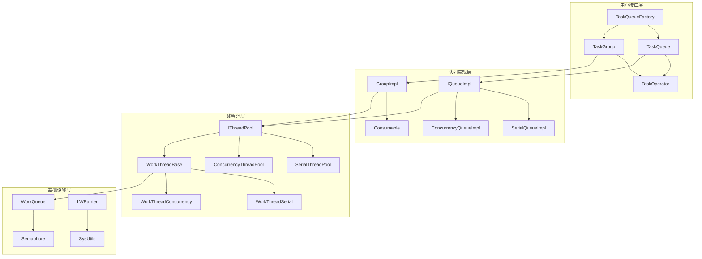
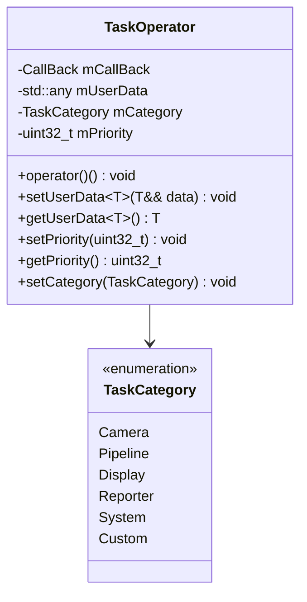
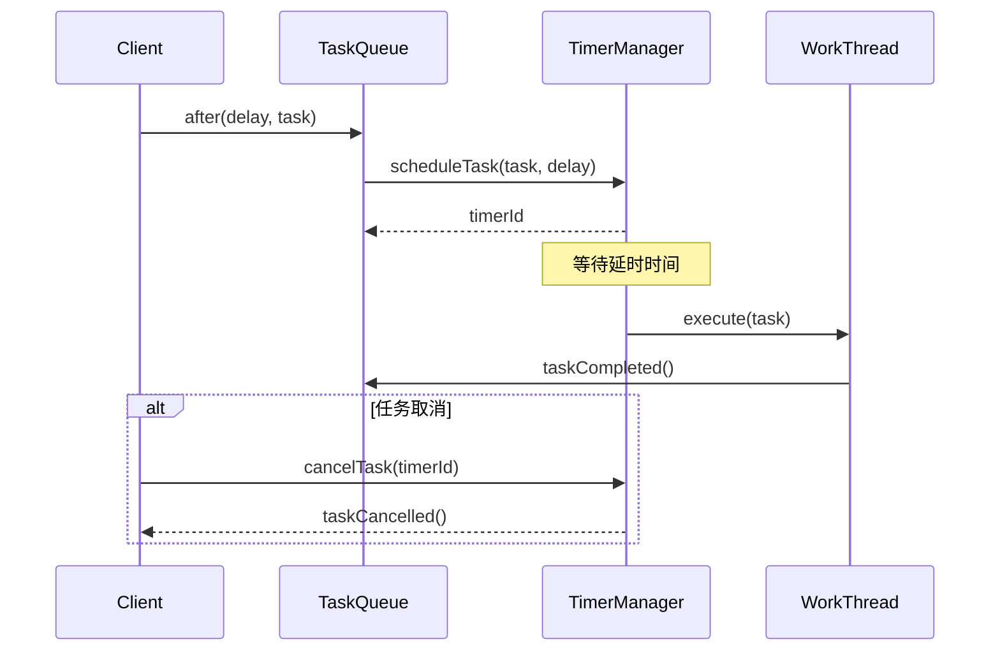
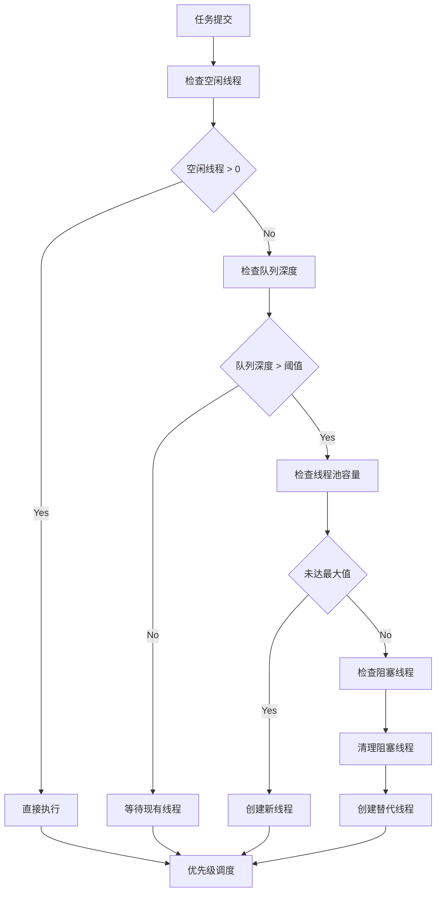
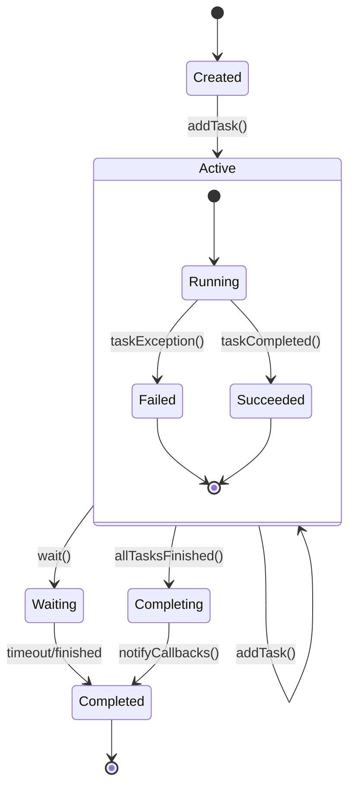
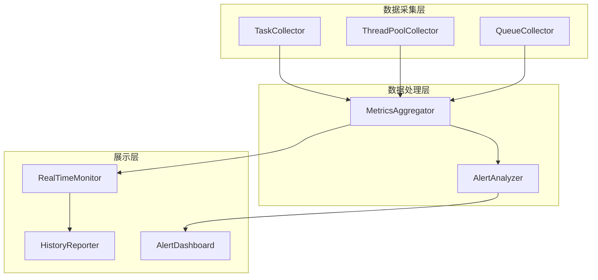
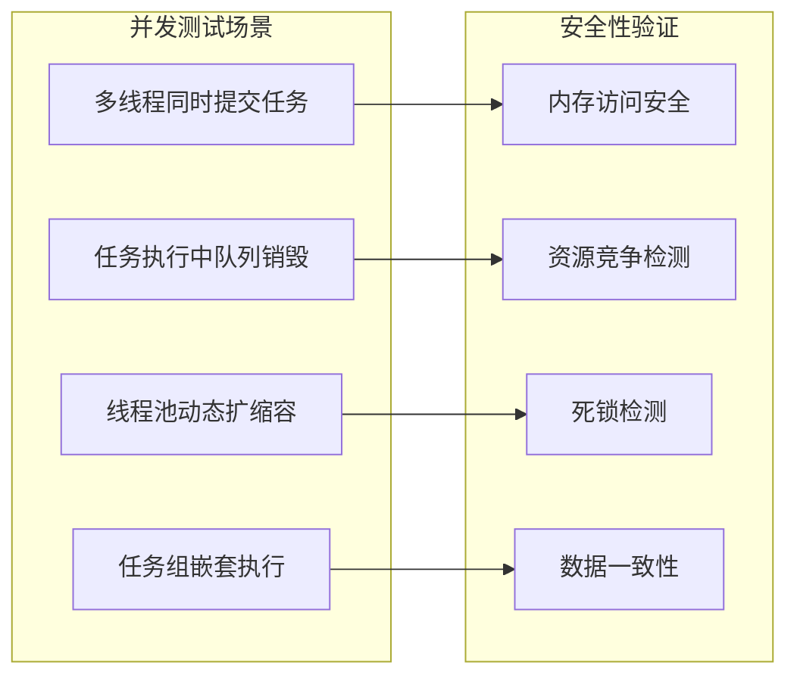

# 线程池任务队列优化重构设计

## 概述

本设计文档针对dispatch_queue目录下的线程池任务队列系统进行优化重构。该系统采用类似iOS GCD的设计思路，提供串行队列、并行队列和任务组功能。通过分析现有架构，识别性能瓶颈和设计问题，提出系统性的优化方案。

### 重构目标
- 保持现有queue + 线程池的设计架构不变
- 优化类接口设计和实现效率
- 增强系统可扩展性和可维护性
- 完善单元测试覆盖率
- 提升整体性能和资源利用率

## 当前架构分析

### 核心组件架构



### 现有设计优势
1. **清晰的分层架构**: 用户接口、队列实现、线程池、基础设施四层分离
2. **GCD兼容性**: 提供async、sync、after等类似GCD的接口
3. **灵活的队列类型**: 支持串行、并行、独占和共享线程模式
4. **任务组功能**: 支持任务分组执行和批量等待
5. **性能统计**: 内置任务执行时间和等待时间统计

### 识别的问题点

| 问题类别 | 具体问题 | 影响程度 |
|---------|---------|---------|
| 接口设计 | TaskOperator回调函数签名复杂，传递shared_ptr<TaskOperator>参数冗余 | 中等 |
| 内存管理 | 大量使用shared_ptr可能导致循环引用和内存泄漏风险 | 高 |
| 延时任务实现 | TaskDelayOperator使用sleep_for阻塞线程，影响线程池效率 | 高 |
| 性能优化 | WorkQueue使用moodycamel::ConcurrentQueue，但未充分利用其批量操作特性 | 中等 |
| 扩展性 | 任务优先级只有3个等级，无法满足细粒度调度需求 | 中等 |
| 监控能力 | 缺乏实时的线程池状态监控和任务队列健康检查 | 中等 |
| 测试覆盖 | 单元测试过于简单，缺乏边界条件和异常处理测试 | 高 |

## 基于现有架构的具体优化建议

### 1. ConcurrencyThreadPool调度优化

#### 当前_schedule函数分析
现有的_schedule函数已经实现了基本的动态线程管理：
- 根据空闲线程数和活跃线程数判断是否需要创建新线程
- 基于队列深度的阈值检查机制
- 自动检测和清理阻塞线程
- 线程超时退出机制

#### 优化方向

**1. 增强负载感知算法**
```
struct EnhancedLoadAnalyzer {
    // 系统负载指标
    double getSystemCpuUsage() const;
    double getMemoryPressure() const;
    
    // 队列负载指标  
    QueuePressureMetrics analyzeQueuePressure(TaskQueuePriority priority) const;
    
    // 线程效率指标
    ThreadEfficiencyMetrics analyzeThreadEfficiency() const;
    
    // 预测性分析
    LoadTrend predictLoadTrend(std::chrono::milliseconds lookAhead) const;
};

struct QueuePressureMetrics {
    size_t currentDepth;
    double growthRate;        // 队列增长率
    double avgWaitTime;       // 平均等待时间
    double taskThroughput;    // 任务吞吐量
};
```

**2. 智能阈值动态调整**
```
class AdaptiveThresholdManager {
public:
    uint32_t getCreateThreshold(TaskQueuePriority priority, 
                               const LoadMetrics& metrics) const {
        // 高优先级任务：更低的阈值，更快响应
        if (priority == TaskQueuePriority::TQP_High) {
            return std::max(1u, static_cast<uint32_t>(metrics.queuePressure * 0.3));
        }
        
        // 普通优先级：平衡响应性和资源利用
        if (priority == TaskQueuePriority::TQP_Normal) {
            return std::max(5u, static_cast<uint32_t>(metrics.queuePressure * 0.6));
        }
        
        // 低优先级：更高阈值，避免过度创建线程
        return std::max(10u, static_cast<uint32_t>(metrics.queuePressure * 0.8));
    }
    
    // 根据系统状态调整最大线程数
    int32_t getOptimalMaxThreads(const SystemMetrics& system) const {
        int32_t baseCores = SysUtils::cpuCount();
        
        // CPU密集型任务：接近核心数
        if (system.avgTaskType == TaskType::CPUIntensive) {
            return baseCores;
        }
        
        // IO密集型任务：可以超过核心数
        if (system.avgTaskType == TaskType::IOIntensive) {
            return static_cast<int32_t>(baseCores * 1.5);
        }
        
        // 混合任务：动态调整
        return static_cast<int32_t>(baseCores * (1.0 + system.ioRatio * 0.5));
    }
};
```

### 2. WorkThreadConcurrency效率优化

#### 现有工作线程分析
当前WorkThreadConcurrency实现已经包含了基本的优化机制：
- 自旋获取信号量减少系统调用
- 优先级从高到低的任务获取策略
- 线程超时退出机制
- 任务执行统计和阻塞检测

#### 进一步优化建议

**1. 增强任务获取策略**
```
// 优化后的_parallel函数
bool WorkThreadConcurrency::_parallel() {
    auto& data = _getThreadPool()->getData();
    
    // 批量获取任务，提高效率
    std::vector<TaskOperatorPtr> taskBatch;
    bool hasWork = acquireTaskBatch(data, taskBatch, BATCH_SIZE);
    
    if (!hasWork) {
        return handleIdleState(data);
    }
    
    // 执行任务批量
    executeBatch(taskBatch);
    return true;
}

bool WorkThreadConcurrency::acquireTaskBatch(
    const std::shared_ptr<IThreadPool::Data>& data,
    std::vector<TaskOperatorPtr>& batch,
    size_t maxBatchSize) {
    
    // 从高优先级到低优先级获取任务
    for (int i = (int)TaskQueuePriority::TQP_High; i >= 0; --i) {
        TaskOperatorPtr task;
        size_t acquired = 0;
        
        // 高优先级任务优先单个执行，低优先级可以批量执行
        size_t targetBatch = (i == (int)TaskQueuePriority::TQP_High) ? 1 : maxBatchSize;
        
        while (acquired < targetBatch && data->mTaskQueues[i].try_dequeue(task)) {
            if (task) {
                batch.push_back(task);
                acquired++;
            }
        }
        
        if (!batch.empty()) {
            return true;
        }
    }
    
    return false;
}
```

**2. 智能空闲管理**
```
bool WorkThreadConcurrency::handleIdleState(
    const std::shared_ptr<IThreadPool::Data>& data) {
    
    data->mIdleThreads.fetch_add(1, std::memory_order_seq_cst);
    
    // 自适应等待策略
    WaitStrategy strategy = determineWaitStrategy(data);
    bool acquired = false;
    
    switch (strategy) {
        case WaitStrategy::AggressiveSpin:
            acquired = data->mSemaphore.spinAcquire(TaskQueueConstant::sMaxSpinCount * 2);
            break;
            
        case WaitStrategy::ModerateWait:
            acquired = data->mSemaphore.waitAcquire(TaskQueueConstant::sMaxSleepTimeout / 2);
            break;
            
        case WaitStrategy::PatientWait:
            acquired = data->mSemaphore.waitAcquire(TaskQueueConstant::sMaxSleepTimeout);
            break;
    }
    
    data->mIdleThreads.fetch_sub(1, std::memory_order_seq_cst);
    return acquired;
}

WaitStrategy WorkThreadConcurrency::determineWaitStrategy(
    const std::shared_ptr<IThreadPool::Data>& data) const {
    
    int32_t activeThreads = data->mActiveThreads.load();
    int32_t idleThreads = data->mIdleThreads.load();
    
    // 系统负载高：积极等待
    if (hasHighSystemLoad()) {
        return WaitStrategy::AggressiveSpin;
    }
    
    // 空闲线程较多：耐心等待，准备退出
    if (idleThreads > activeThreads / 2) {
        return WaitStrategy::PatientWait;
    }
    
    return WaitStrategy::ModerateWait;
}
```

#### 问题分析
当前TaskOperator设计存在以下问题：
- 回调函数需要传递TaskOperator自身的shared_ptr，增加复杂度
- 用户数据通过void*存储，类型安全性差
- 缺乏任务优先级和分类机制

#### 优化策略

**任务执行器接口简化**


**设计改进要点**
- 简化回调函数签名，移除冗余的TaskOperator参数传递
- 使用std::any替代void*提供类型安全的用户数据存储
- 增加任务优先级的细粒度控制（0-255）

### 2. 延时任务机制优化

#### 问题分析
当前延时任务实现存在严重问题：
- TaskDelayOperator使用std::this_thread::sleep_for阻塞整个工作线程
- 延时任务会占用宝贵的线程资源，降低整体并发能力
- 无法取消已提交的延时任务

#### 优化策略

**基于定时器的延时任务机制**


**定时器管理器设计**
- 实现专门的TimerManager类管理延时任务
- 使用单独的定时器线程，不占用工作线程资源
- 基于优先队列实现高效的定时任务调度
- 提供任务取消和状态查询功能

### 3. 线程调度算法优化

#### 现有调度机制分析
ConcurrencyThreadPool中的_schedule函数已经实现了基本的负载均衡机制：
- 基于空闲线程数和活跃线程数的动态调度
- 根据任务队列深度决定是否创建新线程
- 自动检测和清理阻塞线程
- 线程超时退出机制防止资源泄漏

#### 优化策略

**增强的负载均衡算法**


#### 现有_schedule函数优化建议

**增强负载感知算法**
```
// 优化后的_schedule函数逻辑
void ConcurrencyThreadPool::_schedule(TaskQueuePriority priority) {
    const auto idleCount = mData->mIdleThreads.load(std::memory_order_acquire);
    const auto activeCount = mData->mActiveThreads.load(std::memory_order_acquire);
    const auto queueSize = mData->mTaskQueues[static_cast<int32_t>(priority)].size_approx();
    
    // 动态调整创建阈值
    uint32_t createThreshold = getCreateThreshold(priority, activeCount);
    
    // 增强的负载分析
    LoadMetrics metrics = analyzeCurrentLoad(priority, idleCount, activeCount, queueSize);
    
    if (shouldCreateNewThread(metrics, createThreshold)) {
        createOptimalThread(priority, metrics);
    } else if (shouldOptimizeExisting(metrics)) {
        optimizeExistingThreads(metrics);
    }
}

// 负载指标结构
struct LoadMetrics {
    double cpuUtilization;      // CPU利用率
    double queuePressure;       // 队列压力
    double threadEfficiency;    // 线程效率
    TaskQueuePriority priority; // 任务优先级
    int64_t avgTaskDuration;    // 平均任务耗时
};
```

**智能阈值算法**
- 高优先级任务：低阈值，快速响应
- 低优先级任务：高阈值，减少线程创建
- 根据CPU核数和当前负载动态调整
- 引入温度控制，防止频繁创建销毁

**智能调度参数**

| 参数类型 | 现有值 | 优化建议 | 作用 |
|---------|--------|---------|------|
| 最大线程数 | CPU核数 | CPU核数 * 1.5 | 适应IO密集型任务 |
| 队列阈值 | 固定值 | 按优先级动态调整 | 高优先级低阈值 |
| 空闲超时 | 2分钟 | 按负载动态调整 | 高负载时延长超时 |
| 阻塞检测 | 5秒 | 按任务类型调整 | IO任务延长阈值 |

### 4. 任务组生命周期管理

#### 问题分析
当前TaskGroup实现存在的问题：
- 依赖Consumable类实现计数，设计较为复杂
- 缺乏异常处理机制
- notify功能实现不够灵活

#### 优化策略

**改进的任务组管理**


**设计改进**
- 使用状态机模式管理TaskGroup生命周期
- 实现异常传播机制，支持任务失败回滚
- 提供灵活的通知回调配置
- 支持嵌套任务组和条件依赖

### 5. 性能监控与诊断系统

#### 监控指标体系

| 监控维度 | 关键指标 | 监控目的 |
|---------|---------|---------|
| 线程池状态 | 活跃线程数、空闲线程数、队列长度 | 资源利用率监控 |
| 任务执行 | 平均执行时间、最大等待时间、吞吐量 | 性能瓶颈识别 |
| 队列健康 | 队列深度、任务积压时间、丢弃率 | 系统稳定性监控 |
| 异常统计 | 任务失败率、超时率、异常类型分布 | 系统可靠性监控 |

**监控架构设计**


### 6. 内存管理优化

#### 问题分析
- 过度依赖shared_ptr可能导致性能损失
- TaskOperatorBackend中存在多层包装，增加内存开销
- 缺乏对象池化机制，频繁的内存分配影响性能
- 用户数据使用void*存储，类型安全性差

#### 优化策略

**对象池化管理**
- 实现TaskOperator对象池，减少频繁分配
- 为TaskBarrierOperator、TaskDelayOperator等后端对象提供专用池
- 提供可配置的池大小和回收策略
- 使用内存池技术优化小对象分配

**智能指针使用策略**
- 保持现有的shared_ptr使用模式，确保线程安全的对象生命周期管理
- 在TaskOperatorBackend包装类中继续使用shared_ptr管理TaskOperator
- 优化shared_ptr的传递方式，减少不必要的拷贝
- 使用std::any替代void*提供类型安全的用户数据存储，同时保持智能指针管理
- 在对象池化实现中使用shared_ptr管理池中对象的生命周期

## 接口重构建议

### 1. TaskOperator接口简化

**现有接口问题**
- 回调函数签名复杂：`std::function<void(const std::shared_ptr<TaskOperator>&)>`
- 类型不安全的用户数据存储

**重构后接口**
```
class TaskOperator {
public:
    using Callback = std::function<void()>;
    
    // 简化构造函数
    explicit TaskOperator(TaskCategory category = TaskCategory::Custom, 
                         uint32_t priority = 128);
    explicit TaskOperator(Callback callback);
    explicit TaskOperator(TaskCategory category, uint32_t priority, Callback callback);
    
    // 类型安全的用户数据
    template<typename T>
    void setUserData(T&& data);
    
    template<typename T>
    std::optional<T> getUserData() const;
    
    // 任务控制
    void cancel();
    bool isCancelled() const;
    
    // 分类和优先级控制
    void setCategory(TaskCategory category);
    TaskCategory getCategory() const;
    void setPriority(uint32_t priority);
    uint32_t getPriority() const;
};
```

### 2. TaskQueue接口增强

**增加批量操作支持**
```
class TaskQueue {
public:
    // 批量提交任务
    void asyncBatch(const std::vector<TaskOperatorPtr>& tasks);
    
    // 条件执行
    void asyncIf(std::function<bool()> condition, const TaskOperatorPtr& task);
    
    // 重试机制
    void asyncWithRetry(const TaskOperatorPtr& task, int maxRetries, 
                       std::chrono::milliseconds retryDelay);
    
    // 队列状态查询
    QueueStats getStats() const;
    bool isEmpty() const;
    size_t pendingTaskCount() const;
    
    // 队列控制
    void pause();
    void resume();
    void clear();
};
```

### 3. 新增配置管理接口

**线程池配置**
```
struct ThreadPoolConfig {
    int32_t minThreads = 2;
    int32_t maxThreads = std::thread::hardware_concurrency();
    std::chrono::seconds threadIdleTimeout = std::chrono::seconds(60);
    bool enableWorkStealing = true;
    size_t queueCapacity = 1000;
    bool enableTimerOptimization = true;  // 启用定时器优化
};

class ThreadPoolConfigManager {
public:
    static void setConfig(const ThreadPoolConfig& config);
    static ThreadPoolConfig getConfig();
    static void resetToDefault();
    
    // 运行时调整
    static void setMaxThreads(int32_t maxThreads);
    static void setQueueCapacity(size_t capacity);
    static void enableTimerOptimization(bool enable);
};

// 定时器配置
struct TimerConfig {
    std::chrono::milliseconds minDelay = std::chrono::milliseconds(1);
    std::chrono::milliseconds maxDelay = std::chrono::hours(24);
    size_t maxPendingTasks = 10000;
};

class TimerManager {
public:
    static TimerManager& getInstance();
    
    uint64_t scheduleTask(const TaskOperatorPtr& task, std::chrono::milliseconds delay);
    bool cancelTask(uint64_t timerId);
    size_t getPendingTaskCount() const;
    
    void setConfig(const TimerConfig& config);
    TimerConfig getConfig() const;
};
```

## 单元测试完善方案

### 当前测试现状分析
现有测试用例过于简单，主要问题：
- 只测试基本功能，缺乏边界条件测试
- 没有并发安全性测试
- 缺乏性能基准测试
- 异常处理测试不足

### 测试完善策略

#### 1. 功能测试增强

**基础功能测试矩阵**

| 测试类别 | 测试场景 | 验证点 |
|---------|---------|--------|
| 任务执行 | 单任务执行、批量任务执行 | 执行顺序、返回结果正确性 |
| 同步机制 | sync调用、超时处理 | 阻塞行为、超时准确性 |
| 延时任务 | after调用、时间精度 | 执行时机、时间偏差控制 |
| 任务组 | 嵌套组、依赖关系 | 完成通知、异常处理 |

**边界条件测试**
- 空队列操作测试
- 大量任务并发提交测试
- 极端超时值测试（0ms, INFINITE）
- 线程池满载情况测试

#### 2. 并发安全测试

**多线程测试场景**


#### 3. 性能基准测试

**性能测试指标**
- 任务提交吞吐量（tasks/second）
- 平均任务执行延迟
- 内存占用峰值
- CPU利用率

**基准测试场景**
- 大量短任务执行测试
- 少量长任务执行测试
- 混合负载测试
- 内存泄漏检测测试

#### 4. 异常处理测试

**异常场景覆盖**
- 任务执行抛出异常
- 线程池资源耗尽
- 系统资源不足
- 配置参数错误

**测试用例实现建议**
```
// 示例：并发安全测试
class ConcurrencySafetyTest {
    void testConcurrentTaskSubmission() {
        auto queue = TaskQueueFactory::getInstance().globalConcurrencyQueue();
        std::atomic<int> counter{0};
        
        // 启动多个线程同时提交任务
        std::vector<std::thread> threads;
        for (int i = 0; i < 10; ++i) {
            threads.emplace_back([&counter, &queue]() {
                for (int j = 0; j < 1000; ++j) {
                    queue->async([&counter]() {
                        counter.fetch_add(1, std::memory_order_relaxed);
                    });
                }
            });
        }
        
        // 等待所有线程完成
        for (auto& t : threads) {
            t.join();
        }
        
        // 等待所有任务执行完成
        std::this_thread::sleep_for(std::chrono::seconds(1));
        
        // 验证结果
        TestFramework::ASSERT_EQ(counter.load(), 10000);
    }
    
    void testTimerBasedDelayTask() {
        auto queue = TaskQueueFactory::getInstance().globalConcurrencyQueue();
        std::atomic<bool> taskExecuted{false};
        auto startTime = std::chrono::steady_clock::now();
        
        queue->after(std::chrono::milliseconds(500), [&taskExecuted]() {
            taskExecuted.store(true);
        });
        
        // 等待任务执行
        std::this_thread::sleep_for(std::chrono::milliseconds(600));
        auto endTime = std::chrono::steady_clock::now();
        auto duration = std::chrono::duration_cast<std::chrono::milliseconds>(endTime - startTime);
        
        TestFramework::ASSERT_TRUE(taskExecuted.load());
        TestFramework::ASSERT_TRUE(duration.count() >= 500);
        TestFramework::ASSERT_TRUE(duration.count() < 600);  // 允许小量误差
    }
};
```

### 测试框架选择
建议使用轻量级的自定义测试框架，提供以下特性：
- 简单的断言宏定义
- 测试用例组织和执行
- 性能测试工具集成
- 并发安全测试支持

**简单测试框架示例**
```
// 基础测试框架
class TestFramework {
public:
    static void ASSERT_EQ(int expected, int actual);
    static void ASSERT_TRUE(bool condition);
    static void ASSERT_FALSE(bool condition);
    static void ASSERT_TIMEOUT(std::function<void()> func, std::chrono::milliseconds timeout);
    
    // 性能测试
    static void BENCHMARK(const std::string& name, std::function<void()> func, int iterations = 1000);
    
    // 并发测试
    static void CONCURRENT_TEST(const std::string& name, std::function<void()> func, int threadCount = 10);
};

// 测试用例组织
class TaskQueueTest {
public:
    void testBasicAsync();
    void testSyncWithTimeout();
    void testDelayTask();
    void testConcurrentSafety();
    void testPerformanceBenchmark();
};
```

## 实施建议

### 重构优先级排序

| 优先级 | 重构项目 | 实施难度 | 影响范围 | 预期收益 |
|-------|---------|---------|---------|----------|
| P0 | 延时任务机制优化 | 中等 | 核心功能 | 高 |
| P0 | 内存管理优化 | 高 | 全系统 | 高 |
| P1 | 任务执行器接口简化 | 低 | 用户接口 | 中等 |
| P1 | 单元测试完善 | 中等 | 测试体系 | 高 |
| P2 | 性能监控系统 | 高 | 运维支持 | 中等 |
| P2 | 线程池动态管理 | 高 | 资源管理 | 中等 |

### 实施阶段规划

**第一阶段：基础稳定性提升（2周）**
- 修复延时任务的线程阻塞问题
- 实现基于定时器的延时任务机制
- 增加基础的单元测试覆盖

**第二阶段：接口优化重构（3周）**
- 简化TaskOperator接口设计
- 优化内存管理策略
- 重构队列实现类

**第三阶段：性能优化和功能增强（4周）**
- 优化ConcurrencyThreadPool中的_schedule函数
- 实现智能负载均衡算法
- 添加高级队列功能（批量操作、条件执行）
- 实现性能监控系统

**第四阶段：测试完善和系统调优（2周）**
- 完善单元测试用例
- 性能基准测试和调优
- 系统集成测试
- 文档和使用指南编写

### 风险控制措施

**向后兼容性保证**
- 保持现有公共接口不变
- 通过适配器模式支持旧代码
- 分阶段迁移，降低风险

**质量保证措施**
- 每个阶段完成后进行代码审查
- 持续集成环境运行完整测试套件
- 性能回归测试防止性能下降

**回滚计划**
- 保留原有实现作为备份
- 提供快速回滚机制
- 建立问题快速定位和修复流程